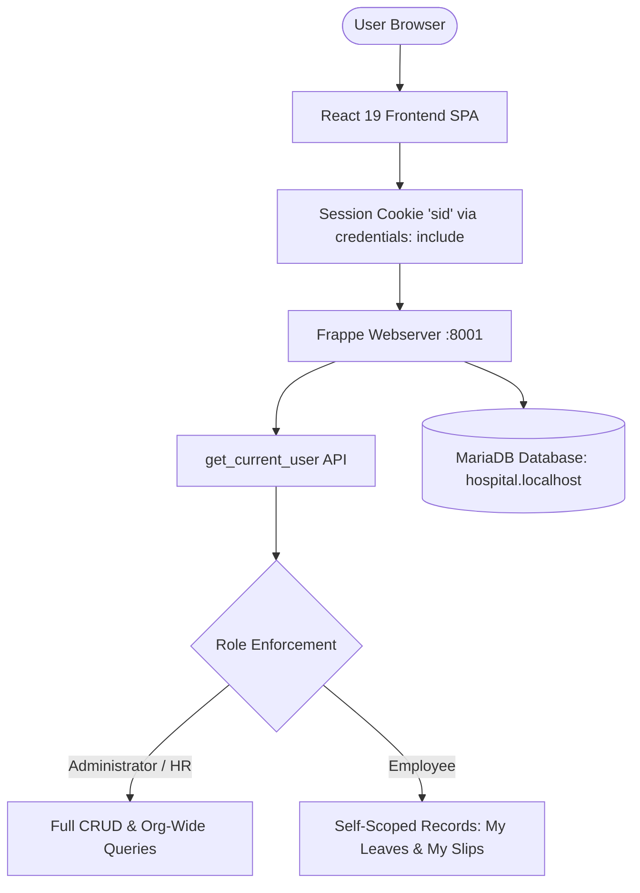

# Employee Management System (EMS)

A full-stack, enterprise-grade **Employee Management System** built with **Frappe Framework (Python 3.11, MariaDB)** on the backend and **React 19 (Vite, Tailwind CSS, shadcn/ui)** on the frontend.

The application delivers seamless role-based workflows, live database synchronization, printable payroll stubs with child table breakdowns, automated Loss of Pay (LOP) payroll calculations, company holiday and shift management, in-app notifications, and a conversational HR assistant grounded in company data with multi-turn session persistence.

---

## 👥 Role-Based Access Control (RBAC) & Demo Logins

The application supports three distinct user roles with full frontend-to-backend enforcement:

| Role | Demo Username | Password | Permitted Modules & Actions |
| :--- | :--- | :--- | :--- |
| 🛡️ **Administrator** | `admin@ems.com`<br>`Administrator` | `SarahJenkins`<br>`admin` | **Full Enterprise Access**: All 10 modules, entire employee directory (CRUD), department hierarchy management, staff attendance oversight, shift types & assignments CRUD, company holiday calendar, leave policy configuration, approving/rejecting leave applications, leave cancellation workflow, applying leave on behalf of staff *(anti self-leave rule strictly enforced)*, generating salary slips with LOP deductions, idempotent batch payroll runs, payslip PDF download & email dispatch tracking, in-app notifications, and SQL Assistant with session management. |
| 📋 **HR Manager** | `hr@ems.com` | `AlexRivera` | **HR Management Portal**: Overview dashboard, employee directory (add/edit profiles), department allocation, shift configuration & assignments, holiday calendar, attendance tracking, reviewing and approving/rejecting staff leave applications, leave cancellation, generating and editing salary slips, batch payroll runs with LOP, email dispatching, in-app notifications, and SQL Assistant. |
| 👤 **Employee** | `employee@ems.com`<br>`sivasakthi@gmail.com` | `DavidChen`<br>`SivaSakthi` | **Self-Service Portal**: Personalized overview, personal profile details, real-time leave balance check, filing leave requests, cancelling pending leave or approved leave before start date, viewing monthly salary paystubs with clean print optimization and PDF download, personal GPS check-in/punch logs, in-app notifications, and scoped SQL Assistant. |

*Quick login buttons are available on the login screen for instantaneous testing across all 3 roles.*

---

## 🏛️ System Architecture & Data Flow



- **Authentication**: Uses Frappe's native session authentication (`/api/method/login` and `/api/method/logout`). The browser maintains the HTTP-only `sid` session cookie with `credentials: "include"` on all API calls.
- **Session & Module Persistence**: On page load or browser refresh (`F5` / `Ctrl+R`), React calls `api.get_current_user` to restore the active session. Navigation state is synchronized with `window.location.hash` and `localStorage`, keeping the user on their current active module without resetting to the dashboard.
- **Security & Scope**: The backend enforces role-scoped query filtering so employees can only access their own private salary slips, profiles, and leave applications.

---

## 🧩 Core Modules & DocType Alignment

| Sidebar Item | Underlying DocType | Description & Capabilities |
| :--- | :--- | :--- |
| 📊 **Dashboard** | N/A | **Admin/HR View**: Enterprise staff headcount, pending leave approval cards, monthly payroll outflow, department statistics, and quick actions (+ Add Employee, + Apply for Leave, Review Leaves).<br>**Employee View**: Personal attendance status & check-in punch, available leave balances, latest net salary summary, recent personal leave requests, and quick Apply Leave modal. |
| 👥 **Employees** | `Employee` | Complete directory for Admin/HR with search, status/department filters, grid/list toggles, and add/edit modals. Scoped to personal profile view for Employee users. |
| 🏢 **Departments** | `Department` | Department master with duplicate prevention, parent-department hierarchy trees, cost centers, and department head assignments. |
| 🕒 **Attendance** | `Attendance`<br>`Employee Checkin` | Daily staff attendance records, GPS clock-in/out geofencing, auto-attendance calculation with strict status priority rules. |
| 🔄 **Shifts & Holidays** | `Shift Type`<br>`Shift Assignment`<br>`Holiday` | Master shift timing configurations (grace periods, hour thresholds, `weekly_off_days`), employee shift assignments, and official company holiday calendar. |
| 📝 **Leave Requests** | `Leave Application` | Self-service leave requests with real-time balance validation, overlap prevention, approver workflow, immediate attendance synchronization on approval, and leave cancellation workflow with attendance status reversion and balance restoration. |
| 🚫 **Leave Policies** | `Leave Type` | Policy configuration for Admin/HR: annual leave limits, carry-forward rollover rules, and custom leave types (including unpaid leave for LOP). |
| 🧾 **Salary Slips** | `Salary Slip`<br>`Salary Slip Allowance`<br>`Salary Slip Deduction` | Full child table support for allowances and deductions. Automated Loss of Pay (LOP) calculations derived dynamically from attendance. Official printable paystub view with clean print optimization, PDF download API, and email dispatch status tracking. |
| 💳 **Payroll Processing** | `Payroll` | Idempotent batch monthly payroll processing with department and designation filters, batch run history, and disbursement tracking. |
| 🤖 **AI Assistant** | `Chat Message`<br>`Chat Session` | Interactive chat assistant grounded in live MariaDB company records with specialized SQL generation, AST SQL Guard validation, "+ New Chat" button, and multi-turn session history persistence. |

---

## 🚀 Key Feature Enhancements

### 1. Weekly Off and Holiday Validation in Auto Attendance
- **Official Company Holidays**: Maintained in `Holiday` DocType (`tabHoliday`).
- **Shift Weekly Offs**: Configurable per shift via `weekly_off_days` (defaults to Saturday, Sunday).
- **Strict Status Priority**:
  $$\text{Holiday (70)} > \text{Weekly Off (60)} > \text{On Leave (50)} > \text{Present (40)} > \text{Half Day (20)} > \text{Absent (10)}$$
- **Priority Guard in Upsert**: Auto-attendance runs with zero punches are strictly prevented from overwriting pre-existing higher-priority records (e.g. Holidays, Weekly Offs, or Approved Leaves).

### 2. Enterprise Leave Workflow & Synchronization
- **Real-Time Balance Checking**: Calculates remaining balance before submission and approval. Prevents deficit leave requests.
- **Overlap Prevention**: Blocks conflicting leave applications covering the same dates.
- **Immediate Attendance Synchronization**: Approving a leave application updates or inserts `tabAttendance` records to `On Leave` across the entire date range within an atomic database transaction.
- **Leave Cancellation Workflow**:
  - Employees can cancel `Pending` leave anytime, or `Approved` leave before start date.
  - Admin/HR can cancel anytime.
  - Automatically reverts attendance records and restores leave balance quota.

### 3. Payroll Automation, Loss of Pay (LOP) & Email Dispatch
- **Automated LOP Calculation**:
  - Dynamically queries unworked `absent_days` and `unpaid_leave_days` from `tabAttendance`.
  - Pro-rates daily salary: $\text{Daily Salary} = \frac{\text{Basic Pay}}{\text{Days in Month}}$.
  - Computes $\text{LOP Deduction} = \text{Daily Salary} \times (\text{absent\_days} + \text{unpaid\_leave\_days})$.
- **Idempotent Batch Payroll**: Generates salary slips for all matching employees, skipping existing slips unless regeneration is requested.
- **Salary Slip PDF Generation & Download**: Generates official PDF paystub documents via `download_salary_slip_pdf`.
- **Email Delivery Tracking**: Tracks status (`Pending`, `Sent`, `Failed`) and timestamp `email_sent_at` for individual and batch email dispatches.

### 4. In-App Notification Bell
- Real-time unread badge counter in `Header.jsx`.
- Popover notification list with Mark Read, Mark All Read, and 30s background polling.
- Integrated across auto clock-out alerts, leave status transitions, batch payroll runs, and email dispatches.

### 5. AI Chat Assistant Session Persistence & Duplicate Prevention
- `Chat Session` DocType stores multi-turn conversation threads.
- "+ New Chat" button allows immediate topic reset.
- **Duplicate Prevention**: Reuses existing empty chat sessions to prevent creating redundant empty "New Chat" sessions when clicked repeatedly.
- Conversation history sidebar with session switching, automatic pruning of empty duplicates, and delete capability.

### 6. Automatic Clock-Out on Shift Completion & Default Shift Resolution
- **Shift End Automated Clock-Out**: Employees still clocked in when their scheduled shift ends are automatically clocked out with exact shift end timestamp and reason `Shift Completed`.
- **Default Shift Fallback**: Automatically resolves company standard `Day Shift` (09:00 - 17:00) when an employee lacks an explicit `Shift Assignment`, preventing unassigned employees from getting stuck in an indefinite "Working" state.
- **Dual-Trigger Execution**: Synchronized via Frappe Scheduler periodic background jobs (`process_shift_completion_job`) and real-time frontend pulse endpoints (`ping_location`, `get_my_attendance_status`).
- **Overtime & Multi-Day Punch Handling**: Evaluates punches against punch start date and closes sessions extending beyond max working hours.

---

## 🛠️ Technology Stack

- **Frontend**:
  - React 19 + Vite 8
  - Tailwind CSS + Lucide React icons
  - shadcn/ui design patterns (`Button`, `Card`, `Badge`, `Dialog`, `Table`, `Input`, `Select`, `Popover`)
- **Backend**:
  - Frappe Framework v15+ (Python 3.11)
  - MariaDB (`hospital.localhost`)
  - Whitelisted REST API methods with session cookies and CSRF protection
- **Vector Database & Knowledge Retrieval**:
  - **Qdrant** running in **Docker** (`http://localhost:6333`, REST & gRPC)
  - `qdrant-client` 1.19+ SDK
  - 384-dimensional dense semantic vector embeddings with Cosine similarity
  - Seamless zero-downtime in-memory NumPy fallback

---

## 🧪 Testing & Code Quality

The entire application is backed by **168 automated unit and integration tests** passing across 11 test suites:

```bash
cd /home/tui013/frappe-benchv/sites

# 1. Automatic Clock-Out Suite (14 Tests)
/home/tui013/frappe-benchv/env/bin/python ../apps/employee_management_system/employee_management_system/test_auto_clock_out.py

# 2. GPS Attendance Security & Validation Suite (19 Tests)
/home/tui013/frappe-benchv/env/bin/python ../apps/employee_management_system/employee_management_system/test_gps_attendance.py

# 3. Shift-Based Automatic Attendance Engine (14 Tests)
/home/tui013/frappe-benchv/env/bin/python ../apps/employee_management_system/employee_management_system/test_shift_attendance.py

# 4. Shift Attendance Enhancements: Holidays & Weekly Offs Suite (5 Tests)
/home/tui013/frappe-benchv/env/bin/python ../apps/employee_management_system/employee_management_system/test_shift_attendance_enhancements.py

# 5. Leave Workflow Enhancements: Balances, Sync & Cancellation (6 Tests)
/home/tui013/frappe-benchv/env/bin/python ../apps/employee_management_system/employee_management_system/test_leave_workflow_enhancements.py

# 6. Payroll & LOP Enhancements: Derivation, Batch Runs & Dispatch (4 Tests)
/home/tui013/frappe-benchv/env/bin/python ../apps/employee_management_system/employee_management_system/test_payroll_enhancements.py

# 7. SQL Guard AST Security & RBAC Suite (34 Tests)
/home/tui013/frappe-benchv/env/bin/python ../apps/employee_management_system/employee_management_system/test_sql_guard.py

# 8. Intent Router & Classification Suite (30 Tests)
/home/tui013/frappe-benchv/env/bin/python ../apps/employee_management_system/employee_management_system/test_intent_router.py

# 9. Chat Orchestrator & Multi-Turn Pipeline (18 Tests)
/home/tui013/frappe-benchv/env/bin/python ../apps/employee_management_system/employee_management_system/test_orchestrator.py

# 10. Natural Language Result Formatter Suite (14 Tests)
/home/tui013/frappe-benchv/env/bin/python ../apps/employee_management_system/employee_management_system/test_result_formatter.py

# 11. Qdrant Vector Database & Resilient Knowledge Engine (10 Tests)
/home/tui013/frappe-benchv/env/bin/python ../apps/employee_management_system/employee_management_system/test_qdrant_knowledge.py
```

*Result: 168/168 tests passing with zero errors.*

### Production Build
```bash
cd apps/employee_management_system/employee_management_system/employee_management_system/frontend
npm run build
# Result: Built cleanly in ~1.4s (0 errors)
```

---

## 📄 License
MIT License © 2026 Enterprise Employee Management System
# Employee-Management-System-Use-Rag
