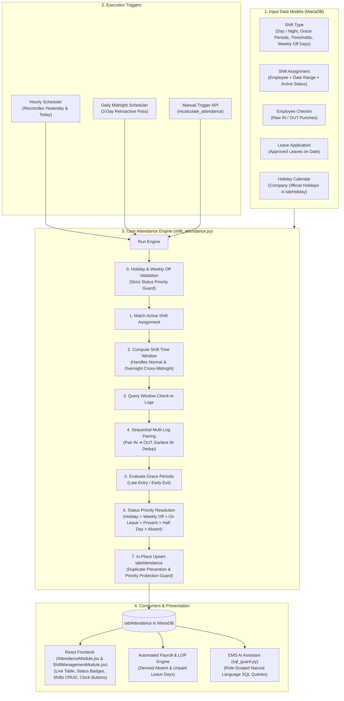
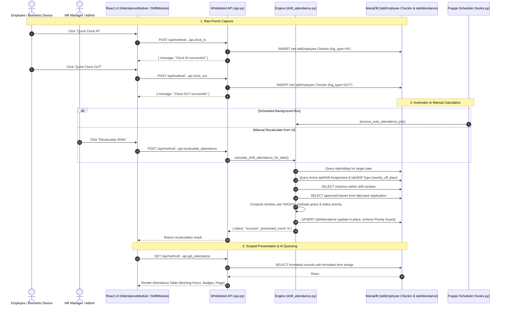

# Shift-Based Automatic Attendance Flow

This document provides a comprehensive overview of the **Shift-Based Automatic Attendance Architecture** implemented in the **Employee Management System (EMS)**. The architecture follows Frappe/HRMS enterprise standards, ensuring that all calculations occur strictly on the Python backend (`shift_attendance.py`) via background jobs or whitelisted API calls, preventing any client-side tampering.

---

## 1. Architecture & Component Hierarchy



---

## 2. Core Data Models in MariaDB

| DocType | Table Name | Purpose | Key Fields |
| :--- | :--- | :--- | :--- |
| **Holiday** | `tabHoliday` | Official company holidays calendar | `name`, `holiday_name`, `holiday_date`, `description` |
| **Shift Type** | `tabShift Type` | Master configuration for work shifts, grace periods, and weekly offs | `name`, `shift_name`, `start_time`, `end_time`, `weekly_off_days`, `is_active`, `enable_auto_attendance`, `late_entry_grace_period`, `early_exit_grace_period`, `working_hours_threshold_for_half_day`, `working_hours_threshold_for_absent`, `working_hours_threshold_for_present`, `begin_check_in_before_shift_start_time`, `allow_check_out_after_shift_end_time` |
| **Shift Assignment** | `tabShift Assignment` | Binds an employee to a shift schedule | `name`, `employee`, `shift_type`, `start_date`, `end_date`, `status` ("Active", "Inactive") |
| **Employee Checkin** | `tabEmployee Checkin` | High-throughput raw punch log (biometric/web/GPS) | `name`, `employee`, `time`, `log_type` ("IN", "OUT"), `shift`, `device_id`, `attendance_source`, `latitude`, `longitude`, `accuracy`, `distance_from_office`, `office_location`, `is_auto_clock_out`, `clock_out_reason` |
| **Attendance** | `tabAttendance` | Canonical daily employee attendance record | `name`, `employee`, `attendance_date`, `status` (`'Present'`, `'Half Day'`, `'Absent'`, `'On Leave'`, `'Holiday'`, `'Weekly Off'`), `shift`, `in_time`, `out_time`, `working_hours`, `late_entry`, `early_exit`, `auto_clocked_out`, `clock_out_reason`, `auto_clock_out_time`, `leave_application`, `leave_type`, `remarks` |
| **Office Location** | `tabOffice Location` | Authorized office coordinates and geofence parameters | `office_name`, `latitude`, `longitude`, `allowed_radius`, `max_accuracy`, `is_active`, `address` |

### Authorized Office Locations
- **Main Office (Headquarters)**: `77, 3rd St, MKG Layout, Gounder Mills, Coimbatore, Tamil Nadu 641029` (`11.056839°N, 76.944754°E`, 150m allowed geofence radius, 50m max GPS accuracy).
- **Chennai Office**: Tidel Park, Tharamani, Chennai (`13.0827°N, 80.2707°E`, 200m radius).
- **Bangalore Office**: Bangalore (`12.9716°N, 77.5946°E`, 200m radius).

---

## 3. Step-by-Step Execution Lifecycle

### Step 3.1: Shift Configuration, Assignments & Weekly Offs
- Administrators or HR Managers define shift schedules in `tabShift Type`:
  - **Day Shift**: e.g., `09:00:00` – `18:00:00`, 15-minute grace periods, 4.0h half-day, 8.0h full-day.
  - **Night Shift**: e.g., `22:00:00` – `06:00:00` (cross-midnight), 15-minute grace periods, 4.0h half-day, 8.0h full-day.
  - **Weekly Offs**: Configured per shift via `weekly_off_days` (e.g. `"Sunday"`, `"Saturday, Sunday"`). Defaults to `"Saturday, Sunday"` if left empty.
- Employees are mapped via `tabShift Assignment` records for an effective date range with `status = 'Active'`.
- Official company holidays are maintained in `tabHoliday` with exact dates.

### Step 3.2: Check-in / Check-out Capture
- Raw punches are ingested into `tabEmployee Checkin` through:
  1. Biometric punch devices or external attendance API integrations.
  2. The React web application's **Quick Clock IN** and **Quick Clock OUT** GPS-validated buttons.
- Every entry stores `employee`, exact `time`, and `log_type` (`IN` or `OUT`).

### Step 3.3: Execution Triggers
The attendance engine is triggered through three channels:
1. **Hourly Background Job** (`process_auto_attendance_job` in `hooks.py`):
   - Automatically runs every hour.
   - Evaluates active shift assignments for **yesterday** and **today**. This ensures that overnight shifts ending at 06:00 AM are finalized during the morning runs.
2. **Daily Midnight Job** (`process_auto_attendance_daily` in `hooks.py`):
   - Automatically runs once a day.
   - Performs a retroactive **3-day reconciliation** to account for delayed log syncs from hardware.
3. **On-Demand Whitelisted API** (`recalculate_attendance` in `api.py`):
   - Allows HR Managers and Administrators to recalculate attendance on demand for any date, shift, or employee directly from the UI.

### Step 3.4: Time Window Calculation & Overnight Shift Handling
For any given target attendance date $D$:
- **Standard Day Shift** ($T_{\text{end}} > T_{\text{start}}$):
  - Window Start: $D \text{ } T_{\text{start}} - \text{buffer}$
  - Window End: $D \text{ } T_{\text{end}} + \text{buffer}$
- **Cross-Midnight Overnight Shift** ($T_{\text{end}} \le T_{\text{start}}$):
  - Shift Start: Anchored on day $D$ ($D \text{ } 22:00$)
  - Shift End: Advances to next calendar day $D + 1$ ($D+1 \text{ } 06:00$)
  - Window Start: $D \text{ } (22:00 - \text{buffer})$
  - Window End: $(D + 1) \text{ } (06:00 + \text{buffer})$

### Step 3.5: Multi-Log Sequential Pairing Algorithm
All check-in logs within the calculated shift window are queried in ascending chronological order:
1. **Consecutive INs**: If an employee registers multiple consecutive IN punches (e.g. `09:02 IN`, `09:05 IN`), the engine preserves the **earliest arrival time** and ignores subsequent duplicate INs.
2. **Orphan OUTs**: Any OUT punch occurring without an active prior IN session is safely skipped.
3. **Paired Intervals**: Each valid `(IN, OUT)` interval is accumulated:
   $$\text{Total Working Hours} = \sum_{i=1}^{N} \frac{\text{OUT}_i - \text{IN}_i}{3600}$$
   *Example*: `09:05 IN` $\rightarrow$ `13:00 OUT` (3.92 hrs) + `14:00 IN` $\rightarrow$ `18:10 OUT` (4.17 hrs) = **8.08 working hours**.

### Step 3.6: Strict Status Priority Resolution Rules

To guarantee enterprise compliance and prevent unjust absent markings, status determination strictly enforces priority ranking:

$$\text{Holiday (70)} > \text{Weekly Off (60)} > \text{On Leave (50)} > \text{Present (40)} > \text{Half Day (20)} > \text{Absent (10)}$$

| Priority | Condition Evaluated | Assigned Status | Business Rules & Notes |
| :---: | :--- | :--- | :--- |
| **1** | Target date exists in `tabHoliday` | **`Holiday`** | **Highest Priority**. Never marked Absent, even if 0 punches occur. |
| **2** | Target weekday is listed in Shift `weekly_off_days` | **`Weekly Off`** | Preserves weekly rest days (e.g. Sunday). Overrides Absent. |
| **3** | Approved `Leave Application` covers target date | **`On Leave`** | If employee worked $\ge 8.0\text{h}$, upgraded to `Present`; otherwise remains `On Leave`. Links `leave_application` and `leave_type`. |
| **4** | Valid check-ins exist and $\text{Working Hours} \ge \text{Present Threshold}$ (e.g. $\ge 8.0\text{h}$) | **`Present`** | Full credit for working the required shift hours. |
| **5** | Valid check-ins exist and $\text{Half Day Thresh} \le \text{Working Hours} < \text{Present Thresh}$ | **`Half Day`** | Partial day credit (e.g., $4.0\text{h} \le \text{Hours} < 8.0\text{h}$). |
| **6** | Normal working day with 0 check-ins or $\text{Working Hours} < \text{Half Day Threshold}$ | **`Absent`** | Marked Absent only when no holiday, weekly off, or approved leave applies. |

### Step 3.7: In-Place Upsert with Status Priority Guard & Idempotency
- **Idempotency**: MariaDB maintains a strict unique constraint on `(employee, attendance_date)`. Running auto-attendance multiple times will update the existing record without generating duplicate rows.
- **Status Priority Guard**: When `upsert_attendance_record` is invoked, it checks the priority of any existing record in `tabAttendance`. If the existing record has a higher priority (e.g. `Holiday`, `Weekly Off`, or `On Leave`) than the newly computed candidate status (e.g. `Absent` when logs are missing), the higher priority status is **strictly preserved** unless `force_status=True`.

---

## 4. End-to-End Sequence Diagram



---

## 5. Whitelisted Backend APIs

### Attendance & GPS Punch APIs
| Endpoint Method | HTTP | Parameters | Description |
| :--- | :--- | :--- | :--- |
| `clock_in` | `POST` | `latitude`, `longitude`, `accuracy` | Secure GPS Clock IN endpoint. Validates coordinates, accuracy, and office geofence; enforces IN sequence |
| `clock_out` | `POST` | `latitude`, `longitude`, `accuracy` | Secure GPS Clock OUT endpoint. Validates coordinates, accuracy, and office geofence; enforces OUT sequence |
| `get_my_attendance_status` | `GET` | — | Real-time status for authenticated employee (status, stopwatch seconds, today's shift, office) |
| `get_my_attendance` | `GET` | `from_date`, `to_date` | Returns authenticated employee's attendance records with formatted time strings |
| `get_office_locations` | `GET` | — | Returns active office locations (name, lat, lon, allowed radius, max accuracy) |
| `employee_checkin` | `POST` | `employee`, `timestamp`, `log_type`, `device_id` | Appends raw punch to `tabEmployee Checkin` |
| `employee_checkout` | `POST` | `employee`, `timestamp`, `device_id` | Convenience wrapper for `log_type='OUT'` |
| `recalculate_attendance` | `POST` | `attendance_date`, `shift_type`, `employee` | Runs attendance calculation engine on demand |
| `get_attendance` | `GET` | `employee`, `from_date`, `to_date` | Returns formatted attendance records with `check_in`, `check_out` times |
| `ping_location` | `POST` | `latitude`, `longitude`, `accuracy` | Geofence heartbeat: auto clocks out if outside office with reason 'Left Office Location' |
| `trigger_shift_completion_clockout` | `POST` | — | Admin/HR trigger to evaluate shift completion and auto clock out at scheduled end time |
| `get_auto_clockout_logs` | `GET` | `employee`, `from_date`, `to_date` | Audit log of automatic clock-outs with reasons and timestamps |

### Shift & Holiday Management APIs
| Endpoint Method | HTTP | Parameters | Description |
| :--- | :--- | :--- | :--- |
| `get_shift_types` | `GET` | — | Returns active shift types with weekly off days, grace periods, and thresholds |
| `create_shift_type` | `POST` | `data` (JSON/dict) | Creates a new Shift Type with `weekly_off_days`, grace periods, and hour thresholds |
| `update_shift_type` | `POST` | `name`, `data` | Updates an existing Shift Type master configuration |
| `delete_shift_type` | `POST` | `name` | Deletes a Shift Type master record |
| `get_shift_assignments` | `GET` | `employee` | Returns active shift assignments for employee or entire organization |
| `create_shift_assignment`| `POST` | `data` (JSON/dict) | Binds an employee to a shift for an effective date range |
| `update_shift_assignment`| `POST` | `name`, `data` | Modifies an existing employee shift assignment |
| `delete_shift_assignment`| `POST` | `name` | Removes a shift assignment |
| `get_holidays` | `GET` | `year` | Returns official company holidays list from `tabHoliday` |
| `create_holiday` | `POST` | `data` (JSON/dict) | Adds a new official company holiday (`holiday_name`, `holiday_date`, `description`) |
| `delete_holiday` | `POST` | `name` | Removes a company holiday from the calendar |

---

## 6. Automated Test Suite Verification

The attendance architecture is validated by **48 automated tests** across four dedicated test suites:

### 6.1 Automatic Clock-Out Suite (`test_auto_clock_out.py` - 10 Tests)
```bash
cd /home/tui013/frappe-benchv/sites
/home/tui013/frappe-benchv/env/bin/python /home/tui013/frappe-benchv/apps/employee_management_system/employee_management_system/test_auto_clock_out.py
```
1. `test_01_geofence_clockout_when_leaving_office`: Clocks out with reason `Left Office Location` when leaving geofence.
2. `test_02_geofence_remains_clocked_in_when_inside_office`: Coordinates within allowed radius remain in Working state.
3. `test_03_geofence_noop_when_not_clocked_in`: Safe no-op when not clocked in.
4. `test_04_shift_completion_clockout_at_shift_end`: Clocks out at exact `shift_end` time with reason `Shift Completed`.
5. `test_05_priority_left_office_before_shift_end`: Priority check: leaving office before shift end logs `Left Office Location`.
6. `test_06_invalid_reason_raises_validation_error`: Enforces strict reason validation.
7. `test_07_exact_attendance_record_fields`: Asserts date, time, reason, and auto flags in `tabAttendance`.
8. `test_08_notifications_created_for_employee_and_admin`: Asserts `Notification Log` records for employee and administrator.
9. `test_09_overnight_shift_completion_clockout`: Verifies cross-midnight overnight shift clocks out at 06:00 next day.
10. `test_10_attendance_status_includes_auto_clock_out_fields`: Real-time status payload exposes auto clock-out details.

### 6.2 GPS Attendance Security & Validation Suite (`test_gps_attendance.py` - 19 Tests)
```bash
cd /home/tui013/frappe-benchv/sites
/home/tui013/frappe-benchv/env/bin/python /home/tui013/frappe-benchv/apps/employee_management_system/employee_management_system/test_gps_attendance.py
```
1. `test_01_haversine_distance_calculation`: Mathematical precision of distance calculation against benchmarks.
2. `test_02_validate_coordinates_valid`: Coordinate bounds verification.
3. `test_03_validate_coordinates_invalid`: Rejection of NaN, null, and out-of-range coordinates.
4. `test_04_validate_gps_accuracy_pass`: Acceptance of readings within $\le 50\text{m}$.
5. `test_05_validate_gps_accuracy_reject`: Rejection with "Location accuracy is too low" error.
6. `test_06_validate_office_radius_inside`: Verification of coordinates inside office geofence.
7. `test_07_validate_office_radius_outside`: Rejection of coordinates outside office radius.
8. `test_08_authenticated_employee_resolution`: Resolves active employee strictly from `frappe.session.user`.
9. `test_09_guest_user_rejected`: Rejection of unauthenticated users.
10. `test_10_inactive_employee_rejected`: Rejection of inactive employees.
11. `test_11_checkin_sequence_validation`: Enforces strict `IN -> OUT -> IN -> OUT` lifecycle.
12. `test_12_clock_in_success`: Successful checkin creation with server timestamp and office metadata.
13. `test_13_clock_in_duplicate_prevention`: Rejection of duplicate Clock IN without Clock OUT.
14. `test_14_clock_out_without_clock_in_rejected`: Rejection of Clock OUT without active Clock IN.
15. `test_15_clock_out_success`: Successful Clock OUT and status recalculation.
16. `test_16_clock_in_low_accuracy_rejected`: Rejection of poor GPS reception at valid coordinates.
17. `test_17_clock_in_outside_office_radius_rejected`: Rejection of remote/spoofed locations.
18. `test_18_get_my_attendance_status`: Payload contract for live status, timer, shift, and office.
19. `test_19_get_office_locations`: Office metadata retrieval endpoint.

### 6.3 Shift Calculation & Rules Suite (`test_shift_attendance.py` - 14 Tests)
```bash
cd /home/tui013/frappe-benchv/sites
/home/tui013/frappe-benchv/env/bin/python /home/tui013/frappe-benchv/apps/employee_management_system/employee_management_system/test_shift_attendance.py
```
- Multi-session log pairing, overnight cross-midnight shifts, grace periods, status determination, and in-place upsert duplicate prevention.

### 6.4 Shift Attendance Enhancements Suite (`test_shift_attendance_enhancements.py` - 5 Tests)
```bash
cd /home/tui013/frappe-benchv/sites
/home/tui013/frappe-benchv/env/bin/python /home/tui013/frappe-benchv/apps/employee_management_system/employee_management_system/test_shift_attendance_enhancements.py
```
1. `test_is_company_holiday`: Confirms company holiday dates from `tabHoliday` resolve accurately with holiday names and non-holidays return false.
2. `test_is_weekly_off_for_shift`: Verifies custom shift weekly off configuration (e.g. Sunday) and fallback to Saturday/Sunday when unspecified.
3. `test_determine_attendance_status_priority`: Validates strict priority sequence: Holiday overrides Weekly Off and Leave; Weekly Off overrides Absent; Approved Leave overrides Absent.
4. `test_status_priority_guard_in_upsert`: Confirms upsert priority guard preserves existing Holiday/Weekly Off/On Leave records against lower-priority auto-attendance runs with zero punches.
5. `test_idempotency_upsert`: Verifies that running upsert multiple times for the same employee and date updates in-place without duplicating database rows.
