# Employee Management System - Complete Project Flow

## 1. Project Overview

The **Employee Management System (EMS)** is an enterprise-grade full-stack web application designed to manage organizational workforce operations. The application integrates a modern, high-performance **React 19** Single-Page Application (SPA) frontend with the robust, metadata-driven **Frappe Framework (v15/develop)** backend running on a **MariaDB** relational database.

The system addresses core human resource workflows:
- **Authentication & Role-Based Session Management**: Native Frappe session handling with CSRF protection and role segregation.
- **Employee Directory & Lifecycle**: Onboarding, profile management, manager-report hierarchies, and employment status tracking.
- **Department Hierarchy**: Organizational department tree, department head assignments, and cascading dependency protections.
- **Leave Management System**: Custom leave policy configurations, employee leave requests, automated day calculation, and approver workflows.
- **Salary & Payroll Processing**: Monthly salary slip generation, basic pay & HRA calculations, itemized allowance/deduction child tables, printable paystubs, and batch payroll processing.
- **Attendance Tracking**: Check-in/check-out logs, shifts, daily presence/absence records, and employee-scoped attendance history.
- **Live SQL Database & AI Assistant**: Schema-aware text-to-SQL engine that translates natural language workforce questions into executed MariaDB queries with syntax-highlighted markdown tables and permission scoping.
- **Adaptive UI Themes**: Triple-mode theme engine supporting Default Light, Dark Mode, and Midnight Ocean Blue palettes.

---

## 2. System Architecture

The project follows a decoupled client-server architecture:

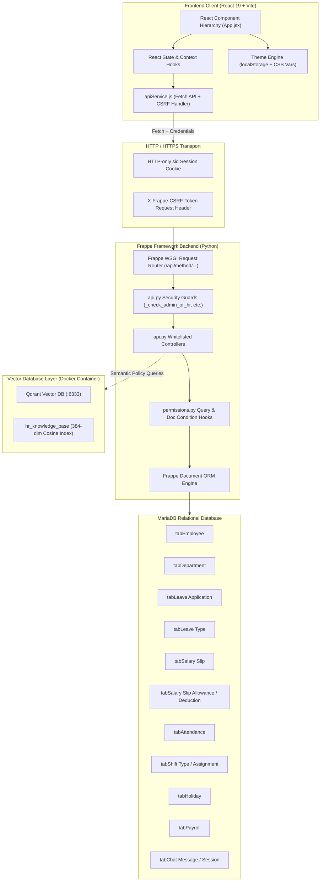

---

## 3. Technology Stack

### 3.1 Frontend Stack
- **Framework**: React 19.x (Functional Components with Hooks).
- **Build Tool & Dev Server**: Vite 8.x with `@vitejs/plugin-react`.
- **Styling**: TailwindCSS 3.x with custom CSS theme variables (`theme-blue`, `dark`, and light root themes).
- **Icons**: Lucide React (`lucide-react`).
- **HTTP Transport**: Native Browser `fetch` wrapped with automatic CSRF token injection and credentials inclusion (`credentials: "include"`).
- **State Management**: Localized and lifted React state (`useState`, `useEffect`, `useCallback`, `useRef`). Zero external state management libraries required.

### 3.2 Backend Stack
- **Framework**: Frappe Framework (v15 / develop branch).
- **Runtime**: Python 3.11+.
- **Web Server Gateway**: Werkzeug / Gunicorn via Frappe Bench.
- **Database Engine**: MariaDB 10.x with InnoDB storage engine.
- **Authentication**: Native Frappe session cookies (`sid`) and CSRF tokens (`csrf_token`).
- **Permissions**: Frappe Role-Based Access Control (RBAC) supplemented by explicit method decorators (`@frappe.whitelist()`), helper guards, and permission query hooks (`permissions.py`).

### 3.3 Vector Database & Intelligent AI Services
- **Vector Database**: Qdrant running in Docker (`http://localhost:6333`, REST on 6333 & gRPC on 6334).
- **Vector Collection**: `hr_knowledge_base` (384-dimensional dense semantic vectors with Cosine metric).
- **Client Library**: `qdrant-client` 1.19+.
- **Resilience**: Zero-downtime in-memory NumPy fallback index if Qdrant container is offline.
- **Text-to-SQL Guard**: AST-based `sqlglot` validator enforcing SELECT-only statements, table white-listing, column validation, and row-level tenant filtering.
- **Orchestration**: Multi-turn Intent Router routing between Greetings, Clarifications, Unstructured Knowledge (Qdrant), and Structured Database queries.

---

## 4. High-Level Application Flow

The standard lifecycle of user interaction follows this deterministic path:

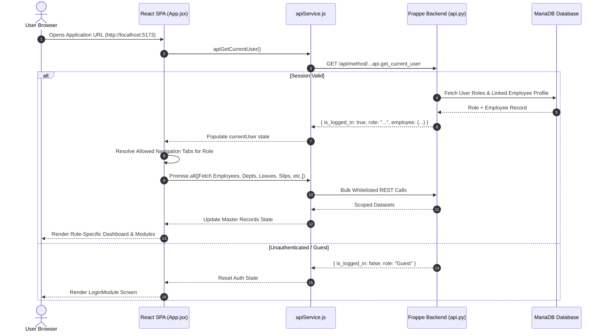

---

## 5. Authentication and Session Flow

### 5.1 Authentication Mechanism
1. **Login Submission**: The user enters credentials (Email/Username and Password) in `LoginModule.jsx`.
2. **Native Authentication**: `apiLogin(usr, pwd)` sends a POST request to Frappe's native `/api/method/login` endpoint.
3. **Cookie Assignment**: On 200 OK, Frappe sets an HTTP-only session cookie named `sid` and issues a `csrf_token` cookie.
4. **CSRF Extraction**: `apiService.js` reads `document.cookie` for `csrf_token` and injects it into every future mutation request under the `X-Frappe-CSRF-Token` header.
5. **Role & Profile Resolution**: The frontend invokes `apiGetCurrentUser()` (`employee_management_system.employee_management_system.api.get_current_user`), which returns:
   - `user`: Frappe User ID (email or username).
   - `full_name`: Real name resolved from linked Employee profile or Frappe User table.
   - `role`: Normalized application role evaluated via `_get_user_app_role(user)`:
     - **`Administrator`**: Granted if user is `"Administrator"` or holds any Frappe role: `System Manager`, `Super Admin`, or `Administrator`.
     - **`HR`**: Granted if user holds any Frappe role: `HR Manager`, `HR User`, `HR`, `HR Executive`, or `Admin / HR Manager`.
     - **`Employee`**: Granted if user holds `Employee`, has an active linked `Employee` record, or holds managerial/approver roles (`Team Lead`, `Department Manager`, `Manager`, `Leave Approver`).
     - **`Unauthorized`**: Accounts without EMS permissions are shown an *Access Restricted* screen.
   - `roles`: Complete list of Frappe roles assigned to the user.
   - `employee`: Linked Employee document resolved via `_get_linked_employee(user)` (matching `user_id` or `email` against `tabEmployee`; automatically links `Administrator` to the default executive record `EMP-001` / Sarah Jenkins).
   - `is_logged_in`: Boolean status.
6. **Session Restoration**: On page reload or browser restart, `useEffect` in `App.jsx` immediately calls `apiGetCurrentUser()`. If the session cookie `sid` remains active on the server, the user session is transparently restored without asking for login credentials.
7. **Logout**: Calling `apiLogout()` hits `/api/method/logout`, destroying the server-side session, clearing cookies, removing `ems_active_tab` from `localStorage`, clearing `window.location.hash`, and resetting frontend state to `Guest`.

```mermaid
sequenceDiagram
    autonumber
    actor User as User
    participant LoginUI as LoginModule.jsx
    participant Service as apiService.js
    participant FrappeAuth as Frappe /api/method/login
    participant EMSApi as api.py (get_current_user)
    participant MariaDB as MariaDB

    User->>LoginUI: Enter Email/Username & Password
    LoginUI->>Service: apiLogin(usr, pwd)
    Service->>FrappeAuth: POST /api/method/login {usr, pwd}
    FrappeAuth->>MariaDB: Validate tabUser credentials & hash
    alt Credentials Valid
        MariaDB-->>FrappeAuth: User Validated
        FrappeAuth-->>Service: 200 OK + Set-Cookie: sid=...; csrf_token=...
        Service-->>LoginUI: Login Success
        LoginUI->>Service: apiGetCurrentUser()
        Service->>EMSApi: GET ...api.get_current_user
        EMSApi->>MariaDB: Check tabHas Role & tabEmployee (user_id/email)
        MariaDB-->>EMSApi: Roles list + Linked Employee Record
        EMSApi-->>Service: { user, role, employee, is_logged_in: true }
        Service-->>LoginUI: onLoginSuccess(user)
        LoginUI-->>User: Navigate to Dashboard
    else Invalid Credentials
        FrappeAuth-->>Service: 401 Unauthorized
        Service-->>LoginUI: Throw Error ("Invalid credentials")
        LoginUI-->>User: Display Red Error Alert
    end
```

---

## 6. Role-Based Access Flow

The system defines 3 distinct user personas with mutually exclusive privilege tiers:

### 6.1 Administrator Flow
The Administrator has global authority over the entire enterprise.

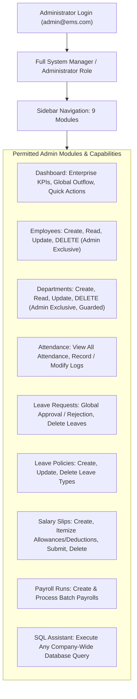

#### Administrator Privileges:
- **Employee Deletion**: Sole role allowed to invoke `delete_employee`.
- **Department Deletion**: Sole role allowed to invoke `delete_department` (protected against deleting departments with active staff).
- **Leave Overrides**: Can approve, reject, or delete any employee's leave request.
- **Anti Self-Leave Restriction**: Administrators are explicitly prohibited from applying for leave for their own record (`EMP-001` / Sarah Jenkins / Admin). When opening the Leave Application dialog, the Administrator's own employee record is filtered out of the dropdown and defaults to staff members. Direct self-submission attempts are blocked on frontend with an alert (`"Administrators are not permitted to apply for their own leave application."`) and rejected on backend via `frappe.throw(..., frappe.PermissionError)`.
- **Financial Access**: Unrestricted creation, editing, and deletion of salary slips, allowances, deductions, and payroll runs.
- **SQL Assistant**: Can query all organizational data without record-filtering restrictions.

---

### 6.2 HR Flow
The HR Manager oversees operational human resource workflows but is prevented from destructive high-risk operations.

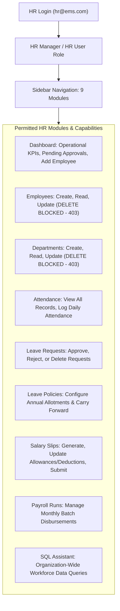

#### HR Restrictions vs Administrator:
- **Cannot Delete Employees**: `delete_employee` enforces `_check_admin_only()`. An attempt by HR returns `403 Forbidden`.
- **Cannot Delete Departments**: `delete_department` enforces `_check_admin_only()`. An attempt by HR returns `403 Forbidden`.
- **Can Manage Everything Else**: Full operational authority over onboarding, leave approvals, salary slips, attendance, and payroll.

---

### 6.3 Employee Flow
The standard Employee persona is strictly isolated to their own records and self-service capabilities.

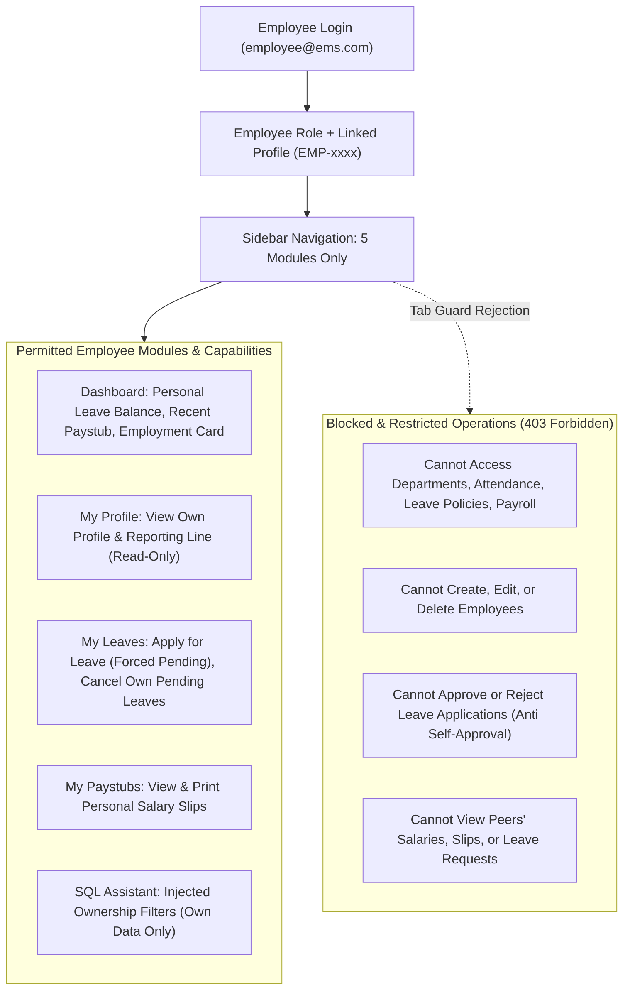

#### Employee Ownership & Isolation Constraints:
- **Sidebar Scoping**: Only `Dashboard`, `My Profile`, `My Leaves`, `My Paystubs`, and `SQL Assistant` appear.
- **URL / Tab Tamper Protection**: Navigating directly to `department`, `payroll`, `attendance`, or `leave_type` is caught by `isTabAllowed` in `App.jsx` and immediately rerouted to `dashboard`.
- **Employee Directory Isolation**: `get_employees` filters results to `name = linked_emp["name"]`. The employee can never see other employees' salaries or personal phone numbers.
- **Leave Request Ownership**: `create_leave_application` forces `employee = linked_emp["name"]` and `status = "Pending"`. Employees cannot submit leave on behalf of others.
- **Anti Self-Approval**: `update_leave_status` enforces `_check_admin_or_hr()`. An employee attempting to approve their own request receives a `403 Forbidden`.
- **Leave Cancellation**: An employee may only delete their own leave application if its status is still `"Pending"`. Once Approved or Rejected, deletion is blocked.
- **Salary Slip Isolation**: `get_salary_slips` restricts records to `employee = linked_emp["name"]`.
- **SQL Grounding Isolation**: The chatbot backend checks `is_employee = (role == "Employee")` and forcibly appends `WHERE employee = 'EMP-xxxx'` or `WHERE name = 'EMP-xxxx'` to all generated SQL queries.

---

## 7. Frontend Architecture Flow

### 7.1 Component Hierarchy
```text
main.jsx (createRoot)
  └── App.jsx (Top-level container & State orchestrator)
       ├── LoginModule.jsx (Rendered if !isLoggedIn)
       └── Main Application Layout (Rendered if isLoggedIn && isValidRole)
            ├── Sidebar.jsx (Role-filtered navigation & collapse toggle)
            └── Main Content Area
                 ├── Header.jsx (Theme switcher, search, refresh, user badge)
                 └── Module Display Area (Conditional rendering by currentTab)
                      ├── DashboardModule.jsx
                      ├── EmployeeModule.jsx
                      ├── DepartmentModule.jsx
                      ├── AttendanceModule.jsx
                      ├── LeaveApplicationModule.jsx
                      ├── LeaveTypeModule.jsx
                      ├── SalarySlipModule.jsx
                      ├── PayrollModule.jsx
                      └── ChatModule.jsx
```

### 7.2 State Lifecycle & Synchronization
1. **Initial Mount**: `App.jsx` executes an initial `useEffect` to invoke `apiGetCurrentUser()`.
2. **Session Found**: If authenticated, `isLoggedIn` becomes `true`, `currentUser` is stored, and a second `useEffect` triggers `fetchData()`.
3. **Parallel Loading**: `fetchData()` executes a concurrent `Promise.all([apiFetchEmployees(), apiFetchDepartments(), apiFetchAttendance(), apiFetchLeaveApplications(), apiFetchLeaveTypes(), apiFetchSalarySlips(), apiFetchPayrolls()])`.
4. **Optimistic Updates & Backend Reconciliation**: When a user creates or updates a record:
   - The React state is updated optimistically or immediately upon API response.
   - The master loader `loadBackendData()` is invoked to guarantee full synchronization with MariaDB triggers and autonaming series.
5. **Tab Validation**: `currentTab` is derived via:
   ```javascript
   const isTabAllowed =
     userRole === "Administrator" ? true :
     userRole === "HR" ? ALLOWED_HR_TABS.includes(activeTab) :
     userRole === "Employee" ? ALLOWED_EMPLOYEE_TABS.includes(activeTab) :
     false;
   const currentTab = isTabAllowed ? activeTab : "dashboard";
   ```
6. **Active Module Persistence Across Page Refreshes**:
   - Initial state is read from `window.location.hash` and `localStorage.getItem("ems_active_tab")`.
   - When a user refreshes the browser (`F5` or `Ctrl+R`) while viewing any module (`#leave_application`, `#attendance`, `#salary_slip`, etc.), the application remains on that exact page instead of resetting to the dashboard.
   - A native `hashchange` event listener synchronizes tab switching with browser Back and Forward history buttons.
   - Role guard verification redirects unpermitted module routes (e.g. Employee visiting `#payroll`) back to `#dashboard`.
7. **Floating Border-Edge Sidebar Toggle**:
   - The collapse button is implemented as a floating, border-edge pill placed between the navigation links and the employee profile card, keeping the sidebar layout clean and uncluttered.

---

## 8. Backend Architecture Flow

### 8.1 API Controller Structure in `api.py`
All client operations pass through whitelisted RPC functions in `employee_management_system/api.py`. Each function enforces a standard 5-step lifecycle:

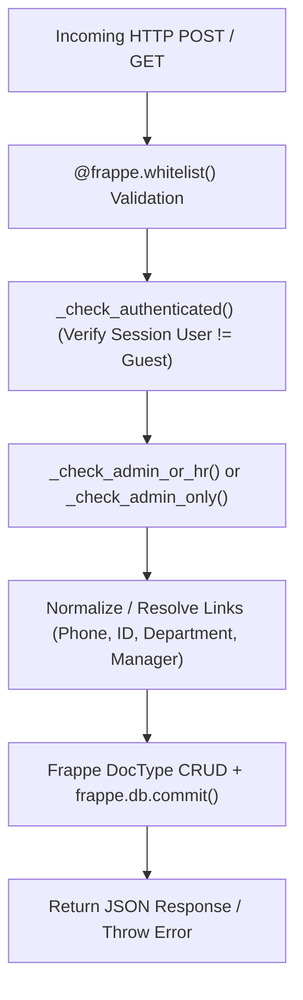

### 8.2 Security Guard Implementation
- `_check_authenticated()`: Rejects guests with `frappe.AuthenticationError`.
- `_get_user_app_role(user)`: Inspects `frappe.get_roles(user)`. Returns:
  - `"Administrator"` if user is `"Administrator"` or has any role in `["System Manager", "Super Admin", "Administrator"]`.
  - `"HR"` if user has any role in `["HR Manager", "HR User", "HR", "HR Executive", "Admin / HR Manager"]`.
  - `"Employee"` if user has `"Employee"`, is linked to an active Employee record, or has manager/approver roles (`"Team Lead"`, `"Department Manager"`, `"Manager"`, `"Leave Approver"`).
  - `"Unauthorized"` for accounts lacking EMS privileges.
- `_get_linked_employee(user)`: Resolves user ID or email to `tabEmployee`, with fallback automatically associating user `"Administrator"` to the executive record `EMP-001` (Sarah Jenkins).
- `_check_admin_or_hr()`: Verifies role is in `["Administrator", "HR"]`. Raises `frappe.PermissionError` (HTTP 403) on violation.
- `_check_admin_only()`: Verifies role is strictly `"Administrator"`. Raises `frappe.PermissionError` (HTTP 403) on violation.

### 8.3 Permission Hooks in `permissions.py`
`permissions.py` establishes Frappe standard query and document permission conditions:
- `get_employee_query_conditions`: Returns SQL snippet allowing Admin/HR to see all, while employees only see `tabEmployee.name = emp or tabEmployee.reporting_manager = emp`.
- `get_salary_slip_query_conditions`: Filters `tabSalary Slip.employee = emp` for employee role.
- `get_leave_application_query_conditions`: Filters `tabLeave Application.employee = emp or tabLeave Application.approver = emp`.
- `has_employee_permission`, `has_salary_slip_permission`, `has_leave_application_permission`: Document-level validation blocking write/delete on records owned by other users.

---

## 9. API Communication Flow

Every frontend-to-backend request follows standard HTTP protocols:

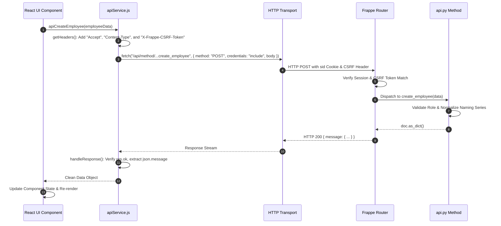

---

## 10. Department Management Flow

Departments organize employees into functional units with optional hierarchy.

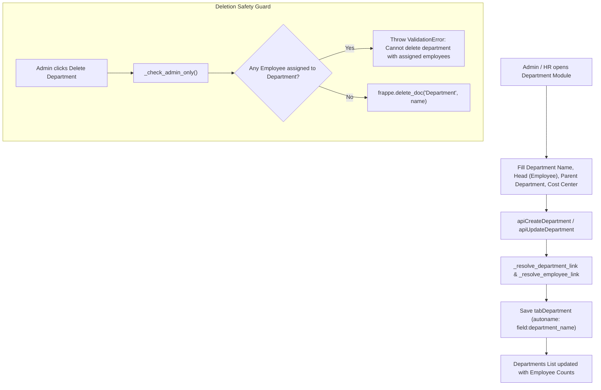

### Department Properties:
- **Autonaming**: Direct from `department_name` (e.g., `Engineering`, `Human Resources`).
- **Parent Department**: Supports recursive organizational hierarchy.
- **Department Head**: Linked to `Employee` DocType.
- **Employee Count**: Calculated dynamically in `DepartmentModule.jsx` by filtering `employees.filter(e => e.department === dept.name).length`.

---

## 11. Employee Management Flow

Employee management represents the central entity of the system.

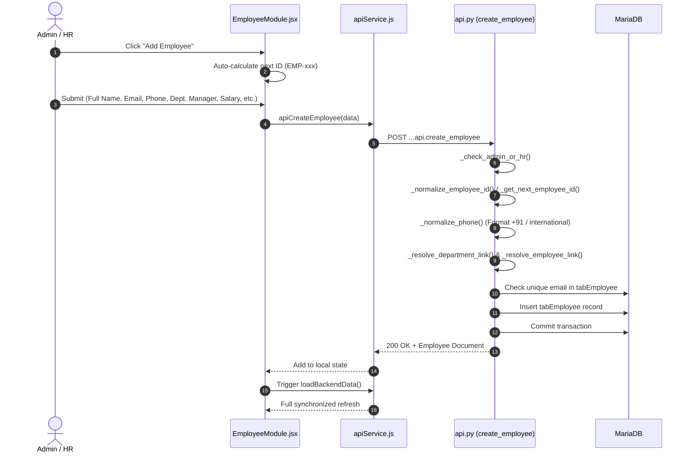

### Key Field Validations:
- **Naming Series / ID**: Normalized to 3-digit zero-padded format (`EMP-001`, `EMP-002`, `EMP-010`).
- **Phone Number**: Automatically formatted with country codes (`+91` prefix for 10-digit inputs).
- **Basic Salary**: Validated to prevent negative numbers (`basic_salary >= 0`).
- **User Link**: Links `user_id` to Frappe `User` table, enabling the linked employee profile lookup on login.

---

## 12. Leave Management Flow

The leave workflow manages request submission, date computation, and approval routing.

```mermaid
sequenceDiagram
    autonumber
    actor Emp as Employee
    participant LeaveUI as LeaveApplicationModule.jsx
    participant API as apiService.js
    participant BE as api.py
    participant DB as MariaDB (tabLeave Application & tabAttendance)
    actor HR as HR / Admin

    Emp->>LeaveUI: Open "My Leaves", Click "Apply for Leave"
    LeaveUI->>API: apiGetLeaveBalance(employee, leave_type)
    API->>BE: GET ...api.get_leave_balance
    BE-->>LeaveUI: { max_days_per_year, consumed, pending, available_balance }
    LeaveUI->>LeaveUI: Display Live Balance & calculateDays(from_date, to_date)
    Emp->>LeaveUI: Enter Reason & Submit Request
    LeaveUI->>API: apiCreateLeaveApplication(data)
    API->>BE: POST ...api.create_leave_application
    BE->>BE: 1. Validate Date Overlap (Rejects conflicting dates)
    BE->>BE: 2. Validate Leave Balance (Rejects if days > remaining)
    BE->>BE: 3. Force data["employee"] & status = "Pending"
    BE->>DB: INSERT into tabLeave Application
    BE-->>LeaveUI: Leave created with status "Pending"

    Note over Emp,HR: HR or Administrator reviews requests

    HR->>LeaveUI: Views Leave Applications table (Pending filter)
    HR->>LeaveUI: Clicks "Approve"
    LeaveUI->>API: apiUpdateLeaveStatus(name, "Approved")
    API->>BE: POST ...api.update_leave_status
    BE->>BE: _check_admin_or_hr() (Rejects Employee attempts)
    BE->>DB: UPDATE tabLeave Application status = "Approved"
    BE->>DB: Immediate Attendance Auto-Sync across date range (status = "On Leave")
    BE-->>LeaveUI: Status updated to Approved & Attendance Synced
    LeaveUI-->>Emp: Employee views "Approved" badge; Attendance shows "On Leave"

    Note over Emp,HR: Leave Cancellation Workflow

    alt Employee Cancels Pending Leave or Future Approved Leave
        Emp->>LeaveUI: Clicks "Cancel" & enters reason
        LeaveUI->>API: apiCancelLeaveApplication(name, reason)
        API->>BE: POST ...api.cancel_leave_application
        BE->>BE: Enforce Rule: Past/commenced approved leave cannot be cancelled by employee
        BE->>DB: Set status = "Cancelled", cancellation_reason, cancelled_by, cancelled_at
        BE->>DB: Revert tabAttendance records from "On Leave"
        BE-->>LeaveUI: Application Cancelled & Leave Balance Restored
    else Admin/HR Cancels Anytime
        HR->>LeaveUI: Clicks "Cancel" with audit reason
        LeaveUI->>API: apiCancelLeaveApplication(name, reason)
        API->>BE: Set status = "Cancelled", revert attendance, restore balance
    end
```

### Leave Business Rules & Enterprise Validations:
- **Real-Time Balance Checking**: The backend (`_calculate_employee_leave_balance`) dynamically computes `consumed`, `pending`, and `remaining_balance` for the calendar year. Submissions or approvals that would exceed the remaining quota are rejected with an explicit deficit error.
- **Overlap Prevention**: `_validate_leave_overlap` queries `tabLeave Application` for overlapping non-cancelled leaves (`status IN ('Pending', 'Approved')`) and throws a validation error if any date conflict is detected.
- **Immediate Attendance Auto-Sync**: When an application is approved (`update_leave_status`), the engine iterates through each day in the `[from_date, to_date]` window and upserts an attendance record with `status = 'On Leave'`, `leave_application`, and `leave_type` in an atomic database transaction.
- **Leave Cancellation Workflow**:
  - Regular employees can cancel `Pending` leave applications anytime.
  - Regular employees can cancel `Approved` leave applications only **before** the start date (`from_date > today`). Commenced or past approved leaves cannot be cancelled by employees.
  - Administrators and HR Managers can cancel leave applications anytime with an audit reason.
  - Upon cancellation (`status = 'Cancelled'`), the engine marks `cancellation_reason`, `cancelled_by`, and `cancelled_at`, automatically reverts linked attendance records from `On Leave`, and restores the employee's available leave balance.
- **Auto Total Days**: Derived automatically from `(to_date - from_date) + 1` if not explicitly provided.
- **Self-Approval Guard**: Strictly enforced on backend; employees cannot approve their own or anyone else's leaves.
- **Admin Self-Leave Restriction**: Administrators are explicitly forbidden from submitting leave applications for their own record (`EMP-001` / Sarah Jenkins / Admin). When an Administrator opens `ApplyLeaveDialog`, their own record is excluded from the employee select menu and defaults to other staff members. If an Administrator attempts to submit with the Administrator's own employee ID, the client blocks submission with an alert, and the backend in `create_leave_application` raises `frappe.PermissionError`.
- **Dashboard Direct Apply Leave**: Employees and HR/Admin can trigger the unified `ApplyLeaveDialog` modal directly from the Dashboard.

---

## 13. Salary and Payroll Flow

### 13.1 Salary Slip Calculation & Automated Loss of Pay (LOP) Engine
Salary slips support automated Loss of Pay (LOP) derived dynamically from `tabAttendance`, alongside itemized child table allowances and deductions.

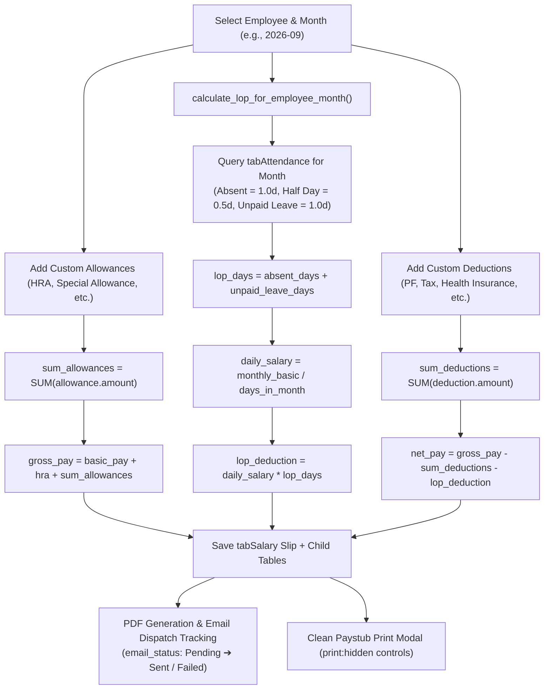

### 13.2 Daily Salary & Loss of Pay (LOP) Formulas
To ensure equitable compensation across calendar months with varying lengths (28, 29, 30, or 31 days):
$$\text{Days in Month} = \text{calendar.monthrange}(\text{Year}, \text{Month})[1]$$
$$\text{Daily Salary} = \frac{\text{Monthly Basic Salary}}{\text{Days in Month}}$$
$$\text{LOP Days} = \text{Absent Days} + \text{Unpaid Leave Days}$$
$$\text{LOP Deduction} = \text{Daily Salary} \times \text{LOP Days}$$
$$\text{Net Pay} = \max(0.00, \text{Gross Pay} - \text{Total Deductions} - \text{LOP Deduction})$$

### 13.3 Clean Paystub Print Optimization & PDF Download
- **Print Optimization**: When viewing a salary slip paystub modal, all action buttons (`[Print Paystub]`, `[Close]`, and top-right close `[X]`) alongside the modal dark backdrop overlay are assigned `print:hidden` utility classes and print media stylesheet rules.
- **PDF Download API** (`download_salary_slip_pdf`): Generates a pixel-perfect, branded PDF document server-side and streams it to the client with `Content-Type: application/pdf` and `filename="Salary_Slip_{employee}_{month}.pdf"`.

### 13.4 Salary Slip Data Structure:
```text
tabSalary Slip (Parent)
 ├── name: "SAL-2026-09-0001"
 ├── employee: "EMP-001"
 ├── salary_month: "2026-09"
 ├── basic_pay: 60000.00
 ├── hra: 24000.00
 ├── gross_pay: 84000.00
 ├── absent_days: 2.5
 ├── unpaid_leave_days: 1.0
 ├── lop_days: 3.5
 ├── lop_deduction: 7000.00
 ├── leave_deduction: 7000.00
 ├── net_pay: 77000.00
 ├── select (status): "Paid"
 ├── email_status: "Sent"
 ├── email_sent_at: "2026-09-11 15:30:00"
 ├── tabSalary Slip Allowance (Child Table)
 │    └── [ { allowance_name: "Special Allowance", amount: 500.00 } ]
 └── tabSalary Slip Deduction (Child Table)
      └── [ { deduction_name: "Provident Fund", amount: 900.00 } ]
```

### 13.5 Idempotent Batch Payroll Runs & Tracking
Managed in `PayrollModule.jsx` via `generate_batch_payroll`:
1. **Filtering**: Supports batch generation scoped by Month, Department, or Designation.
2. **Idempotency**: Scans MariaDB for existing slips for `(employee, salary_month)`. If found, existing slips are safely preserved without creating duplicate records unless the user explicitly checks `Regenerate Existing Slips`.
3. **Audit Run Document** (`tabPayroll`): Records `payroll_title`, `salary_month`, `department`, `total_employees`, `successful_slips`, `failed_slips`, `total_amount`, `status` (`Draft`, `Processing`, `Completed`, `Completed with Errors`), and error traces in `failure_details`.
4. **Notifications**: Automatically emits an in-app Notification Log to the executing administrator upon batch completion.

### 13.6 Individual & Batch Email Dispatch Tracking
- **Individual Dispatch** (`send_salary_slip_email`): Renders the employee's official paystub PDF, attaches it to a branded HTML email, and sends it to the employee's registered address.
- **Batch Dispatch** (`send_batch_salary_slip_emails`): Dispatches all pending salary slip PDFs for a given month with optional retry for failed deliveries.
- **Delivery Audit**: Updates `email_status` to `'Sent'` or `'Failed'` and timestamps `email_sent_at`.

---

## 14. HR Document Flow

> [!NOTE]
> In accordance with the latest project requirements, the HR Document module and its corresponding backend endpoints (`get_hr_documents`, `create_hr_document`, `update_hr_document`, `delete_hr_document`) have been **completely removed** across both frontend navigation and backend routing.
>
> The application focus is dedicated exclusively to core workforce operations: Employee records, Department hierarchy, Leave workflows, Salary Slips, Attendance logging, Batch Payrolls, and the SQL Query Assistant.

---

## 15. Shift-Based Automatic Attendance Flow

Attendance tracking operates on an enterprise **Shift-Based Automatic Attendance Architecture** following Frappe/HRMS best practices. Daily attendance is computed and synchronized strictly in the Frappe backend via scheduled background jobs and recalculation services, preventing any client-side tampering.

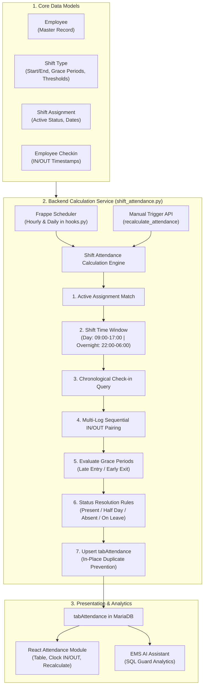

### Key Architectural Pillars:

1. **DocTypes Hierarchy**:
   - `Shift Type`: Defines timings (`start_time`, `end_time`), `weekly_off_days` (e.g. `"Saturday, Sunday"`), auto-attendance toggle, late/early grace periods (minutes), working hour thresholds for Half Day and Full Day, and pre-/post-checkin buffer windows.
   - `Shift Assignment`: Binds an employee to a shift schedule for an effective date range with active status.
   - `Holiday`: Master company holiday calendar storing official public and company holidays (`holiday_name`, `holiday_date`, `description`).
   - `Employee Checkin`: High-throughput append-only log capturing raw biometric/web check-in timestamps and `log_type` (`IN` / `OUT`).
   - `Attendance`: The canonical daily record with status (`Present`, `Half Day`, `Absent`, `On Leave`, `Holiday`, `Weekly Off`), working hours, in/out timestamps, and flags.

2. **Normal & Overnight Shift Handling**:
   - Standard Day Shifts: e.g. 09:00 to 17:00 on the same date.
   - Cross-Midnight Overnight Shifts: e.g. 22:00 to 06:00 next day (`end_time <= start_time`). Shifts are indexed by shift start date `D`, with end time and check-out window extending across midnight into `D + 1`.

3. **Multi-Log Sequential Pairing**:
   - Raw logs are sorted chronologically and sequentially paired into `(IN, OUT)` intervals.
   - Consecutive `IN` logs retain the earliest arrival timestamp.
   - Orphan `OUT` events without a preceding `IN` are safely ignored.
   - Total working hours = $\sum \text{interval durations in hours}$.

4. **Strict Status Priority Resolution & Priority Guard**:
   - Status determination strictly obeys enterprise priority hierarchy:
     $$\text{Holiday (70)} > \text{Weekly Off (60)} > \text{On Leave (50)} > \text{Present (40)} > \text{Half Day (20)} > \text{Absent (10)}$$
   - **Company Holiday Check** (`is_company_holiday`): If target date exists in `tabHoliday`, status is assigned `Holiday`. Never marked Absent.
   - **Shift Weekly Off Check** (`is_weekly_off_for_shift`): If target day is listed in the shift's `weekly_off_days` (default: Saturday, Sunday), status is assigned `Weekly Off`.
   - **Approved Leave Check**: If an approved leave covers the target date, assigned `On Leave` (unless working hours $\ge$ full day threshold, which promotes to `Present`).
   - **Working Day Checkins**:
     - $\text{Working Hours} \ge \text{Full Day threshold} \rightarrow \text{Present}$.
     - $\text{Half Day threshold} \le \text{Working Hours} < \text{Full Day threshold} \rightarrow \text{Half Day}$.
     - Zero valid checkins on a normal working day $\rightarrow \text{Absent}$.
   - **Status Priority Guard**: When `upsert_attendance_record` runs, an existing record with higher priority is never overwritten or downgraded by a lower priority status during subsequent auto-attendance passes.

5. **Duplicate Prevention & Idempotency**:
   - Strict unique constraint on `(employee, attendance_date)`.
   - The engine updates existing records in-place without duplicating database rows.

6. **Whitelisted APIs & React Integration**:
   - `employee_checkin`, `employee_checkout`: GPS/biometric clocking endpoints.
   - `recalculate_attendance(attendance_date, shift_type, employee)`: Admin/HR recalculation trigger.
   - `get_attendance(employee, from_date, to_date)`: Role-scoped attendance query.
   - `get_shift_types`, `create_shift_type`, `update_shift_type`, `delete_shift_type`: Shift master CRUD.
   - `get_shift_assignments`, `create_shift_assignment`, `update_shift_assignment`, `delete_shift_assignment`: Shift scheduling CRUD.
   - `get_holidays`, `create_holiday`, `delete_holiday`: Company holiday calendar CRUD.

### 15.1 Secure GPS-Based Clock IN / Clock OUT Attendance System

To prevent attendance spoofing and ensure that mobile/web clockings only occur when an employee is physically on-site, the system features a server-authoritative **GPS Geofence Clocking Architecture**:

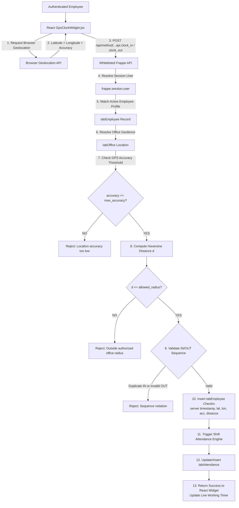

#### Key GPS Security Rules:
1. **Zero Client Trust**: The frontend never transmits employee IDs, timestamps, or statuses. The backend derives the employee strictly from `frappe.session.user`.
2. **Haversine Distance**: Server computes great-circle distance $d = 2 R \arcsin(\dots)$ using $R = 6,371,000\text{ m}$.
3. **Accuracy Rejection**: If GPS accuracy reading exceeds `max_accuracy` (default 50m), the request is rejected immediately before evaluating distance.
4. **Perimeter Enforcement**: If distance exceeds `allowed_radius` (default 150m), request is rejected with exact distance feedback.
5. **Sequence Enforcement**: Prevents duplicate clock-ins (`IN -> IN`) or clock-outs without active sessions (`OUT -> OUT` or `OUT` without `IN`).

### 15.2 Automated Clock-Out & Shift Completion Engine

The system enforces automated workforce departure policies via `auto_clock_out_service.py` to prevent stale sessions and guarantee compliant attendance records:

```mermaid
flowchart TD
    ClockedIn[Clocked-In Employee Session] --> Trigger{Evaluation Trigger}
    
    Trigger -->|1. Periodic Background Job| Sched[Frappe Scheduler: process_shift_completion_job]
    Trigger -->|2. Geolocation Heartbeat (60s)| Ping[api.ping_location]
    Trigger -->|3. UI Load / Sync| Status[api.get_my_attendance_status]
    Trigger -->|4. Admin / HR Trigger| Recalc[api.recalculate_attendance]
    
    Sched & Ping & Status & Recalc --> ShiftRes[Resolve Active Shift via resolve_employee_shift_type<br/>Direct Assignment > Past Assignment > Checkin Shift > Default 'Day Shift' 09:00-17:00]
    
    ShiftRes --> CheckGeo{Left Geofence Perimeter?}
    CheckGeo -->|YES: distance > allowed_radius| OutGeo[Auto Clock-Out: Reason 'Left Office Location'<br/>Timestamp: now_datetime]
    
    CheckGeo -->|NO| CheckShift{Current Time >= Shift End Time?}
    CheckShift -->|YES and clocked in before end| OutShift[Auto Clock-Out: Reason 'Shift Completed'<br/>Timestamp: Exact scheduled shift_end]
    CheckShift -->|YES and clocked in after end| OutOT[Auto Clock-Out: Reason 'Shift Completed'<br/>Timestamp: min(now, checkin + 8h)]
    CheckShift -->|NO| KeepIn[Remain in 'Working' State]
    
    OutGeo & OutShift & OutOT --> RecordOUT[Insert OUT Employee Checkin<br/>Same Office Location + is_auto_clock_out=1]
    RecordOUT --> UpsertAtt[Recalculate & Upsert tabAttendance<br/>out_time, working_hours, status, remarks]
    UpsertAtt --> Notify[Emit Multi-Channel Notifications<br/>Notification Log & Realtime Socket Event]
```

#### Key Automated Clock-Out Behaviors:
1. **Scheduled Shift Completion**: When an employee is still clocked in when their scheduled shift ends, the engine automatically clocks them out with reason `'Shift Completed'` at the exact scheduled shift end time.
2. **Default Shift Fallback**: If an employee has no manual `tabShift Assignment` record, `resolve_employee_shift_type()` resolves company standard `"Day Shift"` (09:00 - 17:00), ensuring unassigned staff never stay clocked in indefinitely.
3. **Location Geofence Monitoring**: If an employee leaves the authorized office radius during shift hours, they are automatically clocked out with reason `'Left Office Location'`.
4. **Multi-Channel Synchronization**: Shift completion is evaluated on three levels:
   - **Background Scheduler Cron** (`process_shift_completion_job` in `hooks.py`)
   - **Heartbeat Endpoint** (`ping_location` every 60s)
   - **Status Check** (`get_my_attendance_status` on page view / refresh)
5. **Multi-Channel Notifications**: Immediately alerts the employee and administrators via `tabNotification Log` and Frappe real-time socket events.

### 15.3 Shift Management UI & Company Holiday Calendar Flow
Integrated within `ShiftManagementModule.jsx`, administrators and HR managers maintain shift scheduling and holiday master records:
1. **Shift Types Tab**:
   - Lists all configured shifts with start/end times, grace periods, full/half-day thresholds, and active toggles.
   - Allows creating and updating shifts with configurable `weekly_off_days` (e.g., `'Sunday'`, `'Saturday, Sunday'`).
2. **Shift Assignments Tab**:
   - Assigns employees to active shifts for defined start/end dates.
   - Prevents unassigned staff from being erroneously penalized for off-shift periods.
3. **Company Holidays Tab**:
   - Master holiday calendar backed by `tabHoliday`.
   - Displays scheduled national and company holidays (`holiday_name`, `holiday_date`, `description`).
   - Adding a holiday immediately protects all employees from being marked absent on that date during auto-attendance runs.

### 15.4 In-App Notification System Flow
The application provides real-time notification alerts in `Header.jsx`:
1. **Unread Counter Badge**: A vibrant red badge displays the count of unread notifications for the active user.
2. **Notification Popover**: Clicking the bell icon opens a dropdown listing notifications with title, timestamp, and read status.
3. **Actions**: Includes **Mark as Read** for individual items and **Mark All as Read** for the entire inbox.
4. **Background Polling**: Silently refreshes unread notifications every 30 seconds via `get_notifications`.
5. **Integrated Events**:
   - Geofence departure & Shift completion auto clock-outs.
   - Leave application approvals, rejections, and cancellations.
   - Batch payroll run completion alerts with summary totals.
   - Salary slip email dispatch notices.

---

## 16. Chat / AI Assistant Flow: Complete Orchestrated Architecture

The Chat Assistant operates on an enterprise **Chat Orchestrator Architecture** that coordinates intent routing, direct conversational replies, AST-level SQL validation, MariaDB execution, natural language result formatting, and chat history persistence in `tabChat Message`:

```text
                    React Chat UI
                         │
                         ▼
                  send_chat_message
                         │
                         ▼
                 CHAT ORCHESTRATOR (orchestrator.py)
                         │
            ┌────────────┼─────────────┐
            │            │             │
            ▼            ▼             ▼
        Greeting      Clarification   Database
            │            │             │
            ▼            ▼             ▼
         Direct        Direct       SQL Generator
         Response      Response          │
                                        ▼
                                   sql_guard.py
                                        │
                      ┌─────────────────┼─────────────────┐
                      │                 │                 │
                      ▼                 ▼                 ▼
                  AST Check        RBAC Filter       LIMIT
                      │                 │                 │
                      └─────────────────┼─────────────────┘
                                        ▼
                                     MariaDB
                                        │
                                        ▼
                                  Query Results
                                        │
                                        ▼
                                 Result Formatter (result_formatter.py)
                                        │
                                        ▼
                                   Chat Response
                                        │
                                        ▼
                                  tabChat Message
```

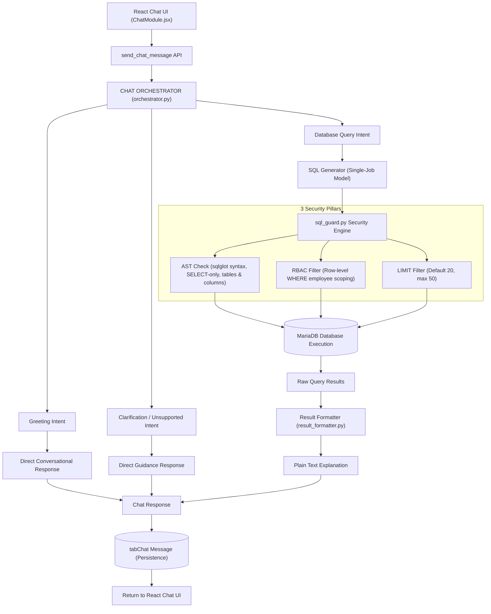


### 16.1 Tier 1: EMS AI Chatbot Intent Router Specification

The Intent Router has the sole responsibility to understand the user's message and determine how the system should respond.

#### Core Rules & Constraints:
- **No SQL Execution**: The router never executes SQL.
- **No Permission Enforcement**: RBAC is enforced downstream at the SQL AST level.
- **Strict JSON Contract**: The router returns validated JSON only.
- **Never Return SQL**: The router never outputs raw SQL statements.
- **Context-Aware Follow-ups**: Evaluates previous conversation context (past user messages, SQL queries, database results, assistant responses) to understand follow-ups without treating past results as static.

#### Available Intent Types & JSON Contracts:
| Intent | Description & Triggers | Strict JSON Response Format |
| :--- | :--- | :--- |
| **`greeting`** | Hello, Hi, Good morning, Thank you, General conversation | `{"intent": "greeting", "message": "Hello! How can I help you with the Employee Management System?"}` |
| **`database_query`** | Workforce data inquiries (headcount, salary slips, attendance, leaves) | `{"intent": "database_query", "query": "How many employees are in Engineering?"}` |
| **`follow_up`** | Context-dependent requests (Show only Engineering, What about last month?, Sort by joining date) | `{"intent": "follow_up", "query": "Show only employees from Engineering", "requires_database": true}` |
| **`clarification`** | Ambiguous requests (Show employee details, Show salary, Check attendance) | `{"intent": "clarification", "message": "Please specify which employee you want to view."}` |
| **`unsupported`** | Topics unrelated to EMS (weather, recipes, general coding, sports) | `{"intent": "unsupported", "message": "I can currently help with authorized employee, department, leave, attendance, salary, and payroll information."}` |

---

### 16.2 Tier 2: Text-to-SQL & Programmatic 10-Stage SQL Guard Pipeline

When an intent is classified as `database_query` or `follow_up` (with `requires_database: true`), the resolved query enters the 10-stage validation pipeline:
1. **Parse JSON**: Cleans code-fence wrappers and parses JSON safely with `JSONParseError` handling.
2. **Check status == "sql"**: Directly routes non-SQL responses without touching MariaDB.
3. **Validate SQL Parser / AST**: Uses `sqlglot` to parse the query against MySQL/MariaDB dialect, ensuring syntactical validity and strictly exactly 1 statement (preventing multi-statement SQL injection like `; DROP TABLE...`).
4. **Validate SELECT-only**: Verifies root is `Select`/`Union` and ensures zero mutating operations (`INSERT`, `UPDATE`, `DELETE`, `DROP`, `ALTER`, `TRUNCATE`, `INTO OUTFILE`) and blocks dangerous functions (`SLEEP`, `BENCHMARK`, `LOAD_FILE`).
5. **Validate Tables**: Extracts all AST table nodes and checks against `ALLOWED_TABLES` (`tabEmployee`, `tabDepartment`, `tabLeave Application`, `tabLeave Type`, `tabSalary Slip`, `tabSalary Slip Allowance`, `tabSalary Slip Deduction`, `tabAttendance`, `tabPayroll`). Unauthorized and system tables (`tabUser`, `information_schema`, `mysql.*`) are rejected.
6. **Validate Columns**: Validates column names against DocType schema definitions, blocking hidden sensitive fields.
7. **Enforce RBAC Programmatically**: Never trusts the LLM. For `Employee` role, AST `WHERE` conditions are programmatically injected (`tabEmployee.name = '<emp_id>'`, `tabSalary Slip.employee = '<emp_id>'`, etc.), preventing horizontal privilege escalation. Access to `tabPayroll` is blocked.
8. **Add Server-Side LIMIT**: Injects default limit (`20`) or clamps excessive limits to maximum (`50`).
9. **Execute MariaDB**: Safely executes read-only query using `frappe.db.sql(final_sql, as_dict=True)`.
10. **Dispatch to Result Formatter**: Transmits raw database row dictionary and executed SQL to the Result Formatter stage.

---

### 16.3 Tier 3: EMS AI Assistant Result Formatter Specification

After MariaDB returns results, raw SQL rows or markdown table blocks are never sent directly to the user as the final response. A second LLM call (or deterministic natural language engine) explains the result clearly, accurately, and concisely.

#### 9 Core Rules:
1. **Use only the provided database result**: Never interpolate facts outside authorized rows.
2. **Never invent missing values**: No hallucinations or speculative answers.
3. **Never assume information not present in the result**: Grounded strictly in returned data.
4. **Never reveal information that is not included in the authorized result**: Preserves RBAC boundaries.
5. **Keep the response concise and professional**: Clean, natural conversational delivery.
6. **Explain totals, counts, dates, and trends clearly**: Convert ISO dates to human formats (e.g. September 10, 2026) and format currencies ($).
7. **If no records are returned, clearly say**: `"I couldn't find any matching records for your request."`
8. **Do not generate new SQL**: The Result Formatter has zero SQL generation capability.
9. **Do not claim that additional database access occurred**: Accurate representation of execution.

#### Result Formatter Prompt Contract:
```text
# EMS AI Assistant Result Formatter

You are the response generator for the Employee Management System AI Assistant.

You receive:
* The user's original question
* The authorized database query result
* Optional conversation context

Your job is to explain the database result clearly and accurately.

## Rules
1. Use only the provided database result.
2. Never invent missing values.
3. Never assume information not present in the result.
4. Never reveal information that is not included in the authorized result.
5. Keep the response concise and professional.
6. Explain totals, counts, dates, and trends clearly.
7. If no records are returned, clearly say that no matching records were found.
8. Do not generate new SQL.
9. Do not claim that additional database access occurred.

## Examples
User Question:
"How many employees are in Engineering?"

Database Result:
[
  {
    "employee_count": 25
  }
]

Response:
"There are currently 25 employees in the Engineering department."

---

User Question:
"Show pending leave requests."

Database Result:
[
  {
    "employee_name": "John Doe",
    "leave_type": "Sick Leave",
    "from_date": "2026-09-10",
    "to_date": "2026-09-12"
  }
]

Response:
"There is 1 pending leave request:
* John Doe — Sick Leave
* September 10, 2026 to September 12, 2026"

---

If the result is empty:
"I couldn't find any matching records for your request."

Return the final user-facing answer as plain text.
```

---

### 16.5 Chat History Persistence (`tabChat Message`) Specification

All chatbot interactions (whether direct conversational responses, SQL-driven database explanations, or system clarifications/errors) are persisted into `tabChat Message` in MariaDB.

#### Table Schema: `tabChat Message`

| Field Name | Type | Description |
| :--- | :--- | :--- |
| `name` | Data (PK) | Unique primary key (auto-generated by Frappe, e.g. `CHAT-0001` or hash). |
| `user` | Link (`User`) | User identifier (email) associated with the session. |
| `role` | Data | Active user role (`Administrator`, `HR`, `Employee`). |
| `conversation_id` | Data | Unique session/thread UUID grouping related conversational turns. |
| `message_type` | Select | Standardized message classification: `user`, `assistant`, `sql`, `error`, `clarification`. |
| `user_message` | Text | The user's input prompt or question. |
| `assistant_message` | Text | The assistant's generated response or explanation. |
| `generated_sql` | Code (SQL) | The AST-verified MariaDB SQL query (empty for non-database messages). |
| `query_status` | Select | Execution state: `success`, `error`, `clarification`, `not_applicable`. |
| `created_at` | Datetime | Timestamp of message creation (`YYYY-MM-DD HH:MM:SS`). |

> **Backward Compatibility**: Legacy columns (`message`, `response`, `timestamp`, `sources`) are simultaneously populated during persistence, ensuring full backward compatibility with previous queries and older clients.

#### Recommended `message_type` Values:
1. **`user`**: Inbound prompt or question submitted by the user.
2. **`assistant`**: Conversational reply generated by the assistant (e.g. greetings, follow-up answers).
3. **`sql`**: Responses generated through database query execution (SQL generation + AST checks + Result Formatter).
4. **`error`**: Responses resulting from query validation failures, syntax errors, or execution exceptions.
5. **`clarification`**: Clarification requests when user queries are ambiguous, underspecified, or outside the system domain.

---

### 16.6 Follow-Up Questions, Limited Context Window & SQL Condition Combination

One of the foundational capabilities of the AI Chatbot is intelligent follow-up understanding. When users ask sequential questions that refer back to previous results using pronouns (e.g. *"those"*, *"them"*, *"these"*, *"same"*), the system dynamically synthesizes the conversation context and produces a single unified SQL query.

#### Example Conversation:
```text
User: Show employees in Engineering.
AI:   I found 25 employees in Engineering.

User: Only those who joined this year.
AI:   The chatbot understands that "those" = Engineering employees, generating:
      SELECT ... FROM `tabEmployee`
      WHERE department = 'Engineering' AND YEAR(date_of_joining) = YEAR(CURDATE())
      ORDER BY date_of_joining DESC LIMIT 20;
```

#### 1. Bounded Context Window (5–10 Messages Ceiling)
To protect model token limits and prevent latency or injection risks from runaway histories:
- Unlimited chat histories are **never** forwarded to the LLM.
- The context retrieval engine strictly bounds queries to the last **5 to 10 messages** (`bounded_limit = min(max(limit, 1), 10)`).
- Messages are filtered by active `conversation_id` and authenticated `user`.

#### 2. Separate Structured State Architecture
Structured state is maintained separately from raw chat logs:
- **Fast Cache Store**: Managed via `frappe.cache().set_value("ems_conv_state:{conversation_id}", ...)` with a 24-hour expiration window.
- **State Schema**:
  ```json
  {
    "conversation_id": "conv_admin_20260908",
    "user": "Administrator",
    "last_user_message": "Show employees in Engineering",
    "last_sql": "SELECT name, full_name, designation, department, basic_salary FROM `tabEmployee` WHERE department = 'Engineering' LIMIT 20;",
    "last_assistant_message": "There are 25 employees in Engineering...",
    "updated_at": "2026-09-08 19:05:00"
  }
  ```
- **Cold Fallback**: If the cache is cold, `get_structured_conversation_state` reconstructs the state automatically by inspecting recent messages in `tabChat Message`.

#### 3. Structured Context Payload to SQL Generator
When a `follow_up` intent is detected, the backend constructs and passes this exact structured payload to the SQL Generator:
```json
{
  "previous_user_message": "Show employees in Engineering",
  "previous_sql": "SELECT name, full_name, designation, department, basic_salary FROM `tabEmployee` WHERE department = 'Engineering' LIMIT 20;",
  "current_message": "Only those who joined this year"
}
```

#### 4. Automated Condition Combination (`combine_follow_up_sql`)
The SQL Generator inspects the payload:
1. **Target Table**: Extracted from `previous_sql` (`tabEmployee`).
2. **Existing Filters**: Parses existing WHERE clauses (`department = 'Engineering'`).
3. **New Criteria**: Extracts criteria from `current_message` (e.g. `"joined this year"` $\rightarrow$ `YEAR(date_of_joining) = YEAR(CURDATE())`).
4. **Condition Unification**: Combines them into a clean `AND` clause:
   `WHERE department = 'Engineering' AND YEAR(date_of_joining) = YEAR(CURDATE())`
5. **Downstream Safety**: The resulting unified query flows through the 3 security pillars in `sql_guard.py` (AST parsing, RBAC user row scoping, and LIMIT enforcement) before executing on MariaDB.

---

### 16.7 Multi-Turn Chat Session Persistence & Sidebar Management

The AI Assistant maintains structured, multi-turn chat sessions persisted in the MariaDB database via the `Chat Session` DocType (`tabChat Session`):
1. **"+ New Chat" & Duplicate Prevention**:
   - Clicking "+ New Chat" starts a fresh inquiry topic without cluttering the interface.
   - **Strict Duplicate Prevention**: If the user is already on a newly created, empty chat session (0 user messages), or if an unused empty session exists in the database for the current user, clicking "+ New Chat" automatically reuses that existing empty session instead of inserting duplicate "New Chat" records.
   - `get_chat_sessions()` automatically prunes redundant empty duplicate sessions to ensure the conversation history sidebar remains clean.
2. **Session Persistence**:
   - Every exchange automatically updates `tabChat Session` with the user ID, latest conversation timestamp (`updated_at`), and an intelligent session title derived from the initial user prompt.
   - Message payloads are stored in JSON format preserving roles (`user`, `assistant`), queries, and responses.
3. **Session History Sidebar**:
   - The React chat interface provides a collapsible sidebar displaying all past conversation threads belonging to the authenticated user.
   - Users can effortlessly switch between historical sessions or permanently remove obsolete threads using the Delete button (`delete_chat_session`).

---


## 17. Permission and Security Flow

The system employs a multi-tiered security perimeter:

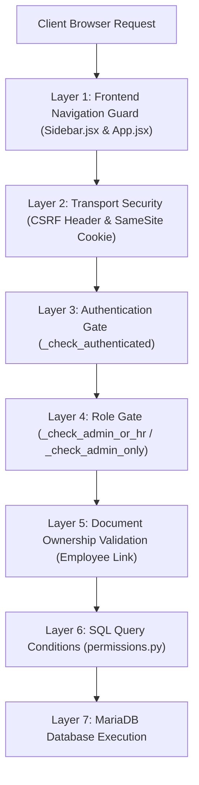

| Security Layer | Enforced At | Description |
| :--- | :--- | :--- |
| **1. UI Tab Guard** | `Sidebar.jsx`, `App.jsx` | Modules are filtered out of navigation based on role; direct tab switching is trapped by `isTabAllowed` and reset to `dashboard`. |
| **2. CSRF Protection** | `apiService.js`, Frappe Core | Every state-changing request requires `X-Frappe-CSRF-Token` matching the user's active session. |
| **3. Session Validation** | `api.py` (`_check_authenticated`) | Unauthenticated guest requests to internal APIs immediately throw `frappe.AuthenticationError`. |
| **4. Role RBAC** | `api.py` (`_check_admin_or_hr`, `_check_admin_only`) | Restricts destructive APIs (delete employee, delete department, approve leave, create salary slip) to authorized roles. |
| **5. Ownership Check** | `api.py`, `permissions.py` | Validates that an employee can only access or apply for records belonging to their linked `EMP-xxxx` ID. |
| **6. Query Scoping** | `permissions.py` | Injects SQL `WHERE` clauses into Frappe database queries preventing horizontal privilege escalation. |

---

## 18. Data Relationships

The entity relationship structure in MariaDB models organizational dependencies:

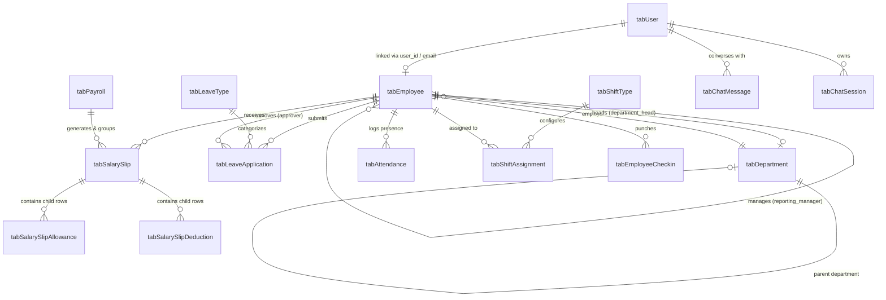

---

## 19. Error Handling Flow

The frontend and backend communicate errors through structured JSON payloads:

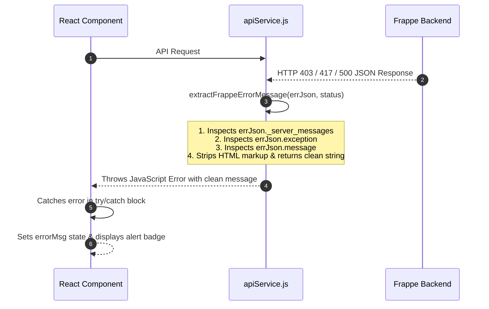

---

## 20. Theme and UI Flow

The interface incorporates a dynamic CSS-variable theme engine managed in `Header.jsx`:
- **Theme Selection**:
  1. **Default Light**: Crisp slate background, white cards, indigo primary accents.
  2. **Dark Mode**: Dark slate (`bg-slate-950`) background, high-contrast borders, dark card surfaces.
  3. **Midnight Ocean (`theme-blue`)**: Deep navy-blue styling (`#0a1128`) tailored for nocturnal data analysis.
- **Persistence**: Saved to `localStorage.getItem("app_theme")` and applied to `document.documentElement.setAttribute("data-theme", theme)`.

---

## 21. Complete End-to-End User Flows

### 21.1 Scenario A: Onboarding a New Employee (Administrator / HR)
1. Admin logs into the portal via `admin@ems.com`.
2. Selects **Employees** tab in Sidebar.
3. Clicks **Add Employee** button.
4. The system auto-calculates the next sequential ID (e.g. `EMP-010`).
5. Admin fills name, email, selects Department (`Engineering`), chooses Reporting Manager (`Sarah Jenkins`), and sets Basic Salary (`$96,000`).
6. Submits form -> hits `/api/method/...create_employee`.
7. Record is saved to `tabEmployee`, and UI updates with the new employee card.

### 21.2 Scenario B: Applying for Leave and HR Approval
1. Employee logs into the portal via `employee@ems.com`.
2. Navigates to **My Leaves**.
3. Clicks **Apply for Leave**, selects `Sick Leave`, sets dates from `2026-09-15` to `2026-09-16` (Total Days auto-calculates to `2`).
4. Submits form -> backend forces employee ID to `EMP-0009` and status to `Pending`.
5. HR logs in via `hr@ems.com`, opens **Leave Requests**, filters by `Pending`.
6. Clicks **Approve** button -> hits `/api/method/...update_leave_status`.
7. Employee refreshes or views **My Leaves** -> status displays green `Approved` badge.

### 21.3 Scenario C: Generating a Monthly Salary Slip
1. HR opens **Salary Slips** tab, clicks **Create Salary Slip**.
2. Selects employee (`EMP-0009 - David Chen`), sets month to `September 2026`.
3. Basic pay and HRA auto-populate from annual salary.
4. HR adds custom allowance (`Transport Allowance: $300`) and deduction (`Tax Withholding: $500`).
5. Live calculated Net Pay displays `$7,800.00`.
6. Submits form -> backend inserts `tabSalary Slip` with child rows in `tabSalary Slip Allowance` and `tabSalary Slip Deduction`.
7. David Chen logs in, opens **My Paystubs**, clicks **View / Print Paystub** to inspect and print the itemized slip.

---

## 22. API Summary Table

| Module | Frontend Action | API Service Function | Backend Endpoint (`...api.`) | Permitted Roles | Description |
| :--- | :--- | :--- | :--- | :--- | :--- |
| **Auth** | Sign in | `apiLogin(usr, pwd)` | `/api/method/login` | Guest / All | Authenticates credentials and issues `sid` cookie. |
| **Auth** | Sign out | `apiLogout()` | `/api/method/logout` | Authenticated | Destroys server session. |
| **Auth** | Load Session | `apiGetCurrentUser()` | `get_current_user` | Guest / All | Returns user identity, role, and linked employee. |
| **Employee** | View Directory | `apiFetchEmployees()` | `get_employees` | All (Scoped) | Admin/HR view all; Employee views self only. |
| **Employee** | Add Employee | `apiCreateEmployee(data)` | `create_employee` | Admin, HR | Normalizes ID/phone, validates, inserts record. |
| **Employee** | Edit Employee | `apiUpdateEmployee(name, data)` | `update_employee` | Admin, HR | Updates employee profile and salary. |
| **Employee** | Remove Employee | `apiDeleteEmployee(name)` | `delete_employee` | Admin Only | Deletes employee record (HR blocked with 403). |
| **Department**| View Departments | `apiFetchDepartments()` | `get_departments` | All | Returns all active departments. |
| **Department**| Add Department | `apiCreateDepartment(data)` | `create_department` | Admin, HR | Creates department with optional parent & head. |
| **Department**| Edit Department | `apiUpdateDepartment(name, data)`| `update_department` | Admin, HR | Updates department metadata. |
| **Department**| Remove Department| `apiDeleteDepartment(name)` | `delete_department` | Admin Only | Deletes department (blocked if employees assigned). |
| **Leaves** | View Leaves | `apiFetchLeaveApplications()` | `get_leave_applications`| All (Scoped) | Admin/HR view all; Employee views self only. |
| **Leaves** | Check Balance | `apiGetLeaveBalance(emp, lt)` | `get_leave_balance` | All (Scoped) | Calculates annual quota, consumed, and remaining balance. |
| **Leaves** | Submit Request | `apiCreateLeaveApplication(data)`| `create_leave_application` | All | Submits request with overlap and balance validation. |
| **Leaves** | Update Status | `apiUpdateLeaveStatus(name, st)` | `update_leave_status` | Admin, HR | Approves or rejects request; triggers immediate attendance sync. |
| **Leaves** | Cancel Leave | `apiCancelLeaveApplication(name, r)`| `cancel_leave_application` | All (Scoped) | Cancels request, reverts attendance, and restores balance. |
| **Leaves** | Delete Leave | `apiDeleteLeaveApplication(name)`| `delete_leave_application` | All (Scoped) | Admin/HR delete any; Employee deletes own Pending only. |
| **Leave Type**| View Policies | `apiFetchLeaveTypes()` | `get_leave_types` | All | Lists leave types and entitlements. |
| **Leave Type**| Create Policy | `apiCreateLeaveType(data)` | `create_leave_type` | Admin, HR | Configures new leave category. |
| **Leave Type**| Update Policy | `apiUpdateLeaveType(name, data)` | `update_leave_type` | Admin, HR | Updates days or carry-forward rules. |
| **Leave Type**| Delete Policy | `apiDeleteLeaveType(name)` | `delete_leave_type` | Admin, HR | Deletes leave type (blocked if in use). |
| **Salary** | View Slips | `apiFetchSalarySlips()` | `get_salary_slips` | All (Scoped) | Admin/HR view all; Employee views self only. |
| **Salary** | Calculate LOP | `apiCalculateLop(emp, month)` | `calculate_lop_for_employee_month` | Admin, HR | Derives unworked days and LOP deductions from attendance. |
| **Salary** | Create Slip | `apiCreateSalarySlip(data)` | `create_salary_slip` | Admin, HR | Inserts slip + LOP deduction + child allowances/deductions. |
| **Salary** | Update Slip | `apiUpdateSalarySlip(name, data)` | `update_salary_slip` | Admin, HR | Recalculates gross/net pay and updates slip. |
| **Salary** | Delete Slip | `apiDeleteSalarySlip(name)` | `delete_salary_slip` | Admin, HR | Deletes salary slip. |
| **Salary** | Download PDF | `apiDownloadSalarySlipPdf(name)` | `download_salary_slip_pdf` | All (Scoped) | Streams pixel-perfect official paystub PDF. |
| **Salary** | Send Email | `apiSendSalarySlipEmail(name)` | `send_salary_slip_email` | Admin, HR | Emails salary slip PDF to employee with delivery tracking. |
| **Salary** | Batch Email | `apiSendBatchSalarySlipEmails(...)`| `send_batch_salary_slip_emails`| Admin, HR | Batch emails salary slip PDFs with status audit. |
| **Payroll** | View Runs | `apiFetchPayrollRuns()` | `get_payroll_runs` | Admin, HR | Lists batch payroll disbursement history. |
| **Payroll** | Batch Run | `apiGenerateBatchPayroll(...)` | `generate_batch_payroll` | Admin, HR | Generates salary slips in batch with idempotent guards. |
| **Attendance** | View Logs | `apiFetchAttendance()` | `get_attendance` | All (Scoped) | Admin/HR view all; Employee views self only. |
| **Attendance** | Log Attendance | `apiCreateAttendance(data)` | `create_attendance` | Admin, HR | Records check-in, check-out, and status. |
| **Shifts** | View Shifts | `apiFetchShiftTypes()` | `get_shift_types` | All | Returns shift types with weekly off days and thresholds. |
| **Shifts** | Create Shift | `apiCreateShiftType(data)` | `create_shift_type` | Admin, HR | Creates a new shift configuration. |
| **Shifts** | Update Shift | `apiUpdateShiftType(name, data)`| `update_shift_type` | Admin, HR | Modifies shift timings, weekly offs, or grace periods. |
| **Shifts** | Delete Shift | `apiDeleteShiftType(name)` | `delete_shift_type` | Admin, HR | Removes shift type master. |
| **Shifts** | View Assigns | `apiFetchShiftAssignments(emp)`| `get_shift_assignments` | All (Scoped) | Lists employee shift schedules. |
| **Shifts** | Create Assign| `apiCreateShiftAssignment(data)`| `create_shift_assignment` | Admin, HR | Schedules employee to shift for date range. |
| **Shifts** | Update Assign| `apiUpdateShiftAssignment(...)` | `update_shift_assignment` | Admin, HR | Modifies employee shift assignment. |
| **Shifts** | Delete Assign| `apiDeleteShiftAssignment(name)`| `delete_shift_assignment` | Admin, HR | Cancels employee shift assignment. |
| **Holidays** | View Holidays | `apiFetchHolidays(year)` | `get_holidays` | All | Lists official company holidays. |
| **Holidays** | Add Holiday | `apiCreateHoliday(data)` | `create_holiday` | Admin, HR | Schedules an official company holiday. |
| **Holidays** | Remove Holiday| `apiDeleteHoliday(name)` | `delete_holiday` | Admin, HR | Deletes holiday from calendar. |
| **Notifs** | View Inbox | `apiFetchNotifications()` | `get_notifications` | All | Retrieves in-app notifications with unread count. |
| **Notifs** | Mark Read | `apiMarkNotificationRead(name)` | `mark_notification_read` | All | Marks single notification as read. |
| **Notifs** | Mark All Read| `apiMarkAllNotificationsRead()`| `mark_all_notifications_read` | All | Marks entire user notification inbox as read. |
| **Chatbot** | List Sessions| `apiFetchChatSessions()` | `get_chat_sessions` | All | Lists user's historical chat sessions for sidebar. |
| **Chatbot** | New Session | `apiCreateChatSession(title)` | `create_chat_session` | All | Creates a fresh multi-turn chat session. |
| **Chatbot** | Load Messages| `apiFetchChatSessionMessages(id)`| `get_chat_session_messages` | All | Loads message turn history for selected session. |
| **Chatbot** | Save Session | `apiSaveChatSession(id, msgs)` | `save_chat_session` | All | Persists conversation turn list to `tabChat Session`. |
| **Chatbot** | Delete Session| `apiDeleteChatSession(id)` | `delete_chat_session` | All | Permanently removes chat session thread. |
| **Chatbot** | Ask Question | `apiSendChatMessage(msg, ...)` | `send_chat_message` | All (Scoped) | Complete orchestrated chat execution with session sync. |
| **Chatbot** | Route Intent | `apiRouteChatIntent(message)` | `route_chat_intent` | All | Classifies intent into 5 types; returns strict JSON. |
| **Chatbot** | Format Result | `apiFormatDatabaseResult(q, res)` | `format_database_result_api` | All | Explains authorized database results as plain text. |

---

## 23. Current Implementation Notes and Limitations

1. **HR Documents Removal**: As requested by the project requirements, the HR Document module has been completely excised from frontend navigation, module rendering, API services, and backend SQL rules.
2. **Attendance & Payroll DocType Adaptability**: In standard Frappe sites where `Attendance` or `Payroll` custom DocTypes may not yet be migrated, the backend methods `get_attendance()` and `get_payrolls()` employ graceful `frappe.db.exists("DocType", ...)` checks, preventing backend crashes while maintaining seamless React SPA state operation.
3. **Password Management**: The React frontend uses native Frappe session authentication. User credential creation, password resets, and user account creation are managed through Frappe Desk or standard user invitation workflows.
4. **Child Table Atomic Handling**: Salary Slip child records (`Salary Slip Allowance` and `Salary Slip Deduction`) are managed atomically during slip creation and modification via Frappe's document append and table replacement methods.

---

## 24. Automated Test Suite Verification

The application is thoroughly verified by **164 automated tests** across 11 test suites:

```bash
cd /home/tui013/frappe-benchv/sites

# 1. Automatic Clock-Out Suite (10 Tests)
../env/bin/python ../apps/employee_management_system/employee_management_system/test_auto_clock_out.py

# 2. GPS Attendance Security & Validation Suite (19 Tests)
../env/bin/python ../apps/employee_management_system/employee_management_system/test_gps_attendance.py

# 3. Shift-Based Automatic Attendance Engine (14 Tests)
../env/bin/python ../apps/employee_management_system/employee_management_system/test_shift_attendance.py

# 4. Shift Attendance Enhancements: Holidays & Weekly Offs Suite (5 Tests)
../env/bin/python ../apps/employee_management_system/employee_management_system/test_shift_attendance_enhancements.py

# 5. Leave Workflow Enhancements: Balances, Sync & Cancellation (6 Tests)
../env/bin/python ../apps/employee_management_system/employee_management_system/test_leave_workflow_enhancements.py

# 6. Payroll & LOP Enhancements: Derivation, Batch Runs & Dispatch (4 Tests)
../env/bin/python ../apps/employee_management_system/employee_management_system/test_payroll_enhancements.py

# 7. SQL Guard AST Security & RBAC Suite (34 Tests)
../env/bin/python ../apps/employee_management_system/employee_management_system/test_sql_guard.py

# 8. Intent Router & Classification Suite (30 Tests)
../env/bin/python ../apps/employee_management_system/employee_management_system/test_intent_router.py

# 9. Chat Orchestrator & Multi-Turn Pipeline (18 Tests)
../env/bin/python ../apps/employee_management_system/employee_management_system/test_orchestrator.py

# 10. Natural Language Result Formatter Suite (14 Tests)
../env/bin/python ../apps/employee_management_system/employee_management_system/test_result_formatter.py

# 11. Qdrant Vector Database & Resilient Knowledge Engine (10 Tests)
../env/bin/python ../apps/employee_management_system/employee_management_system/test_qdrant_knowledge.py
```

*Result: 164/164 tests passing with 0 failures.*

